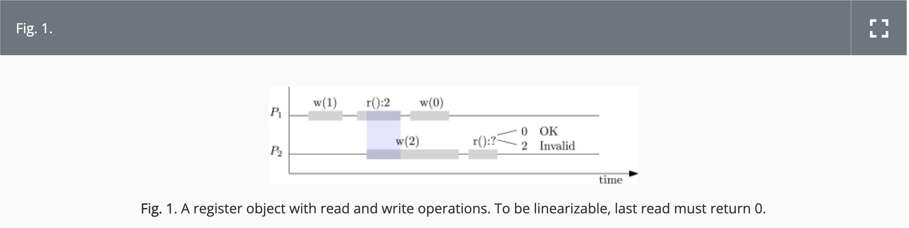

[Approaches to Conflict-free Replicated Data Types](https://dl.acm.org/doi/10.1145/3695249)

이 글은 위 CRDT 관련 글을 번역한 것임

# Abstract

충돌 없는 복제 데이터 타입(CRDTs)은 낙관적 복제를 원칙적으로 가능하게 합니다.

서로 다른 복제본들은 네트워크 분할 상황에서도 독립적으로 진행할 수 있으며, 항상 결정적으로 수렴합니다.

즉, 동일한 업데이트를 수신한 복제본들은 업데이트 수신 순서가 달라도 동일한 상태를 가지게 됩니다.

순차적 데이터 타입에서 CRDT에 이르는 진화의 역사를 살펴본 후, 본 문서에서는 연산 기반(operation-based)과 상태 기반(state-based)이라는 두 가지 주요 CRDT 접근 방식을 상세히 설명하며, 순수 연산 기반(pure operation-based)과 델타 상태 기반(delta-state based)이라는 두 가지 중요한 변형도 함께 다룹니다.

앞으로 CRDT 연구자와 설계자를 지향하는 독자들을 위해 작성된 이 문서는 필수 개념들에 대해 탄탄하게 다루면서, 자주 발생하는 오해들을 명확히 하고, 구체적인 CRDT 설계와 CRDT 접근 방식 설계 경험에서 얻은 새로운 통찰도 제시합니다.

# 1. Introduction

전통적인 분산 시스템은 Lamport가 제안한 상태 기계 복제(state-machine replication) 방식을 통해 강력한 일관성(예: 선형화(linearizability))을 달성하고자 합니다.

그러나 이러한 시스템들은 높은 처리량을 달성할 수는 있지만, 공간적으로 넓은 시스템에서 강한 일관성을 달성하려면 높은 응답 시간과 네트워크 분할 시 가용성 상실이라는 대가를 치러야 합니다(이는 CAP 정리 [17, 34]에서 표현됨).

실제 비즈니스 환경에서 항상 가용해야 한다는 중요성 때문에 일관성을 완화하는 방향으로 접근하게 되었습니다.

Amazon의 Dynamo [27]와 같이 “약간의 장애라도 심각한 재정적 손실과 고객 신뢰 저하로 이어진다”는 가용성의 중요성을 강조하는 선구적 연구가 등장했습니다.

그러나 NoSQL 데이터 저장소를 프로그래밍하는 것은 낮은 수준의 읽기-쓰기 기반 API와 동시 업데이트에 대한 애드혹(임시방편) 조정 때문에 어렵고 오류가 발생하기 쉬웠습니다.

CRDT가 등장한 이후 [78], 곧바로 인기를 끌기 시작했습니다.

CRDT의 핵심 개념은

(1) 전통적 데이터 타입처럼 높은 수준의 API를 제공하면서,

(2) 네트워크 분할 상황에서도 즉각적인 로컬 복제본 업데이트와 질의를 허용해 가용성을 보장하고, 비동기적 통신을 통해 복제본들이 수렴하도록 하며,

(3) 데이터 타입 특유의 동시성 의미론과 동기화 메커니즘을 내장해 개발자가 임시방편 조정 코드를 작성할 필요가 없도록 하는 것입니다.

CRDT는 설계가 어렵고 미묘한 버그가 발생하기 쉬우나, 소수의 CRDT 전문가가 새로운 CRDT를 만들어내는 복잡한 과정을 거치지 않고도 대부분의 분산 애플리케이션 프로그래머가 라이브러리로부터 손쉽게 사용할 수 있습니다.

이 글은 주로 예비 CRDT 연구자나 설계자를 대상으로 하나, CRDT 사용자라면 CRDT의 작동 원리를 아는 것에 큰 도움을 받을 수 있습니다.

본 문서는 연산 기반과 상태 기반의 두 가지 주요 접근 방식을 설명하며, 그 변형으로 델타 상태 기반 접근 방식과 순수 연산 기반 접근 방식을 함께 소개합니다.

또한 본 문서는 CRDT에 관한 논문이나 발표에서 자주 발생하는 오해들을 바로잡으며, 예를 들어 인과 상태 기반 CRDT의 조인(join)에 대한 직관을 제공하는 등 새로운 시각을 제시합니다.

“CRDT는 교환 법칙(commutative)을 만족하는 타입이다”라는 오해를 바로잡기 위해, 연산 기반 CRDT의 실행 모델을 보다 나은 도식으로 제시합니다.

또 다른 예로, 상태 기반 CRDT에서 “변경자(mutator)는 단조(monotonic)해야 한다”는 오해 대신, 실제로는 상태가 팽창(inflation)해야 한다는 점을 논의합니다.

이 글에서는 순차적 데이터 타입을 연산 기반 및 상태 기반 CRDT 설계에 재사용할 수 있는 조건으로 교환 법칙, 멱등성, 팽창성을 명확히 하며, 연산 기반 CRDT의 prepare가 부작용이 없어야 한다는 고전적 요구사항도 논의합니다.

만약 질의에 사용되는 추상 상태와 CRDT의 구체적 상태를 구분한다면, 이 요구사항은 완화될 수 있으며, 이를 통해 보다 나은 설계를 이끌어낼 수 있음을 보여줍니다. 또한 기존 설계보다 우수한 관측-제거(observed-remove) 집합 구현을 소개합니다.

순차적 데이터 타입에서 CRDT로의 진화 역사를 살펴본 후, 다음과 같이 구성됩니다.

- 연산 기반 CRDT
- 순수 연산 기반 CRDT
- 상태 기반 CRDT
- 델타 상태 기반 CRDT

그 후, 각 접근 방식의 비교, 확장성을 위한 식별자 관리(identity management), 그리고 실제 응용 사례를 논의합니다.

글 전체에서는 카운터, 레지스터, 집합과 같은 고전적 예제를 사용합니다.

이들은 설명과 이해가 비교적 간단하면서도 각 접근 방식을 비교할 수 있을 만큼의 미묘한 특성을 가지고 있습니다.

리스트(List)와 같이 더 복잡한 데이터 타입(예: Treedoc [70], RGA [74])은 훨씬 복잡한 알고리즘을 필요로 하므로 배제합니다.

협업 편집과 리스트 데이터 타입에 관한 논의는 9장 “Practical Applications”에서 다룹니다.

# 2. From Sequential Data Types to CRDTs

## 2.1. From Sequential to Concurrent Data Abstractions

### 데이터 추상화.

추상화는 복잡성을 제어하고 확장성을 확보하는 데 필수적입니다. 추상화에는 함수적 추상화와 데이터 추상화라는 두 가지 주요 유형이 있습니다.

함수적 추상화(함수와 프로시저)는 Fortran, Lisp, Algol(1958년경)에 처음 도입되었고, 데이터 추상화는 추상 데이터 타입(Abstract Data Types, ADTs)과 객체(object)라는 두 가지 주요 변종으로 오랜 기간 진화해왔습니다.

데이터 타입을 얻기 위한 기본 요소로는 일반적으로 프로시저, AED-1 언어[75]에서 도입된 레코드(당시 “plexes”라 불림)가 있으며, 이 레코드가 Algol에 Wirth와 Hoare에 의해 채택되었습니다.

그리고 프로시저와 레코드의 결합이 있습니다.

실제로 일어난 일은 [63] Algol 블록을 스택 할당에 국한되지 않도록 일반화한 것이며, Simula [26]에서는 프로세스(후에 클래스로 발전)로 사용되었습니다.

최종적으로 CLU [56]에서 표현을 클라이언트 코드로부터 숨기는(inner block) 기법이 도입되어 추상 데이터 타입(ADT)이 탄생했습니다.

### 순차적 데이터 타입.

명령형 언어에서 순차적 데이터 타입은 라이브러리에서 가장 일반적인 추상화로 자리잡았습니다.

Set과 Map과 같은 타입의 제공은 “만능 공구”처럼 많은 문제를 해결해 주어, 프로그래머가 매번 “바퀴를 재발명”하는 일을 줄여주고, 느리고 버그가 있는 구현을 피하게 해주었습니다.

이러한 순차적 데이터 타입에 대한 효율적인 명령형 구현에 관한 연구는 “실제 세계”에 매우 유용했습니다.

순차적 데이터 타입의 경우, (별도의 aliasing이 없을 때) 올바름을 증명하는 것이 비교적 쉽습니다.

이는 Hoare [42]에 의해 도입된 전제, 사후 조건, 불변조건 개념과 데이터 타입에의 적용 [43] 덕분입니다.

다만, 반복되는 aliasing 현상은 문제를 야기할 수 있으며, Rust와 같은 언어는 가변 상태 공유를 피하도록 설계되었습니다.

### 동시성 데이터 타입.

순차적 데이터 타입을 공유 메모리 동시성으로 확장해 동시 스레드가 사용할 수 있는 객체를 만드는 것은 자연스러운 발전이었습니다.

Simula에서 영감을 받은 Hansen [38]은 공유 클래스 개념을 도입한 모니터(monitor)를, Hoare [44]는 약간의 변형을 도입하였습니다.

모니터는 연산 실행 중 상호 배제를 강제하여, 동시성이 발생하지 않는 원자적 객체(atomic object)를 구현할 수 있게 했습니다.

이로 인해 전제/사후 조건과 불변조건을 사용한 추론이 용이해졌으나, 동시에 중간에 블록킹(await 또는 조건 변수)을 허용하여 동시 프로세스 간 협력을 위한 필수적인 도구가 되었습니다.

하지만, 이로 인해 추론이 복잡해집니다.

블록킹 추상화는 공유 메모리 동시성에서는 흔하지만, 분산 시스템에서는 덜 일반적입니다(예: 분산 잠금). 이는 CRDT가 항상 로컬에서 가용해야 한다는 점과 맞지 않습니다.

### Lock-free 및 Wait-free 자료구조.

멀티프로세서에서 성능과 내결함성을 달성하기 위해 lock-free 자료구조가 제안되었습니다.

이들은 잠금을 사용하지 않고, 하드웨어가 제공하는 낮은 수준의 원자적 연산(compare-and-swap 등)을 직접 사용합니다.

이를 통해 여러 데이터 타입 연산이 동시에 진행될 수 있고(모니터처럼 상호배제가 필요하지 않음), 만약 wait-free [39]라면, 다른 프로세스의 행위와 상관없이 유한한 단계 내에 연산이 완료됨을 보장합니다.

이들은 멀티프로세서를 대상으로 하며 분산 시스템과는 직접적인 관련은 없지만, 동시적으로 여러 동작이 진행될 때 올바름 기준을 어떻게 표현할 것인가에 대한 문제를 제기합니다. 이 문제는 분산 시스템에서도 중요한 문제입니다.

## 2.2. Strongly Consistent Replication

### 선형화(Linearizability).

선형화 [40]는 동시 연산이 있더라도 순차적 데이터 타입이 노출하는 동작을 모방하도록 구현하기 위해 널리 사용되는 올바름 기준입니다.

대략적으로 어떤 실행이 선형화되려면 (1) 순차 실행과 동등해야 하며, (2) 겹치지 않는 연산에 대해 “실제 시간” 순서를 존중해야 합니다.

예를 들어, 두 프로세스가 접근하는 레지스터 객체(그림 1)를 생각해 봅시다.

만약 레지스터가 선형화를 제공한다면, 마지막으로 반환한 연산이 w(2)임에도 불구하고 r() 연산은 0을 반환해야 합니다.

이는 r()가 2를 반환했다면, w(2)가 r() 연산보다 앞서 효과를 발휘했어야 하며, 블루로 표시된 구간 내에 w(2)가 위치했어야 한다는 의미입니다.

### 복제 상태 기계(Replicated State Machinem).

데이터 타입의 분산 구현이 선형화를 따르도록 얻는 방법 중 하나는 Lamport [52]가 제안한 상태 기계 복제 방식을 사용하는 것입니다. 이 방식은 기본적으로 다음과 같이 구성됩니다.

1. 여러 노드에 상태를 복제한다.
2. 각 노드에서 동일한 결정론적 상태 기계 \( \sigma \)를 실행하여, 다음 상태를 현재 상태와 입력의 함수로 계산한다.
3. 모든 노드의 입력에 대해 전역적 총 순서를 합의한다.
4. 각 노드에서 총 순서대로 입력을 적용한다.

그 결과, 복제 시스템은 단일 기계처럼 동작하게 됩니다. 가장 어려운 부분은, 특히 내결함성을 위해, 합의(agreement) 문제입니다 [68].

극단적인 경우 Byzantine Faults를 견디기 위해 PBFT 알고리즘 [23]의 변형을 사용하는 블록체인 시스템이 있습니다.

순차 데이터 타입을 상태 기계로 사용하면 복제 데이터 타입이 됩니다. 이로 인해 분산 데이터 타입 구현 문제가 해결된 것처럼 보일 수 있으나, 여전히 해결할 문제들이 남습니다.

## 2.3. The CAP Theorem and Consistency Models

### CAP 정리.

PODC’00 회의에서 Brewer [17]는 분산 시스템에서는 강한 일관성(strong Consistency), 가용성(Availability), 분할 내성(Partition tolerance) 중 최대 두 가지만 동시에 달성할 수 있다고 주장했습니다.

이 가설은 [34]에서 증명되었으며, 특히 강한 일관성을 선형화로 해석함으로써 CAP 정리로 알려지게 되었습니다.

이는 세 가지 특성 중 두 가지만 선택할 수 있음을 함축합니다. 그러나 네트워크 분할은 언제든 발생할 수 있으므로, AP 혹은 CP 시스템으로 설계할 수밖에 없습니다: 즉, 가용성을 선택하거나 강한 일관성(선형화)을 선택하는 것입니다.

### CP vs. AP.

CAP 정리는 분산 시스템 설계에 있어 중요한 선택지를 내포합니다.

선형화(CP)를 달성할 것인지 혹은 가용성(AP)을 달성할 것인지 결정해야 합니다.

네트워크 분할이 없더라도, 이 선택은 응답 시간에도 영향을 미칩니다. 대략적으로, CP 시스템은

- 선형화를 목표로 하며,
- 네트워크 분할 시 가용성이 상실될 수 있고,
- 광역 네트워크에서는 응답 시간이 길어집니다.

반면 AP 시스템은

- 네트워크 분할 시에도 연산이 계속 가능하며,
- 광역 네트워크에서도 응답 시간이 짧을 수 있습니다.

선형화를 포기할 경우, 중요한 문제는 어떤 일관성 모델을 목표로 할 것인가입니다.

### 일관성 모델.

일관성 모델의 정의는 지난 수십 년 동안 중요한 연구 주제로 다루어졌습니다.

이는 “기계”의 효율적 사용, 구현 용이성, 추론의 용이성, 혹은 유용한 보증과 같은 여러 측면에서 타협점을 포함합니다.

Viotti와 Vukolic [82]은 40개 이상의 모델을 제시합니다.

이 중 인과 일관성(Causal Consistency, CC)은, 가용성을 잃지 않으면서 달성 가능한 가장 강력한 모델로 중요합니다 [57].

### 인과 일관성.

인과 일관성(CC)은 각 프로세스가 서로 다른 순서를 볼 수 있도록 허용하되, 전역적 “happens-before” 부분 순서와 일치하도록 합니다.

happens-before (\( \rightarrow \))는 각 프로세스 내의 세션 순서 \( \rightarrow_s \)와, 연산 a의 효과가 b를 수행하는 프로세스에 보이는 경우의 가시성 순서 \( \rightarrow_v \)의 전이 폐쇄로 구성됩니다.

인과 일관성은 본질적으로 모든 인과적 과거의 연산들이 누락 없이 보인다는 의미입니다. 프로세스들은 전역 가시성 부분 순서와 호환되는 서로 다른 총 순서를 채택할 수 있지만, (인과 일관성 그 자체만으로는) 수렴을 보장하지는 않습니다.

### 수렴.

AP 시스템이 목표로 하는 가장 강력한 보증은 인과 일관성과 강력한 최종 일관성(SEC; Strong Eventual Consistency) [78]입니다. 이는 모든 업데이트가 결국 어디서나 보이게 되고(최종적 가시성/전달), 동일한 업데이트 집합을 본 프로세스들은 도달 순서에 상관없이 동등한 상태를 가지게 됨을 보장합니다.

여기서 SEC라는 용어는 강한 일관성과 연관된 “strong”이라는 단어 때문에 오해의 소지가 있었으며, Terry 등 [80]이 처음 도입한 Eventual Consistency(EC)도 이미 SEC의 보증을 포함하고 있습니다.

해당 논문에서는 EC 시스템이 다음 두 가지 속성을 보장해야 한다고 설명합니다:

- 전파의 총합(total propagation): 각 업데이트가 어떤 anti-entropy 메커니즘(즉, 최종적 전달)을 통해 결국 모두에게 전파됨
- 일관된 순서(ordering): 교환 법칙을 만족하지 않는 업데이트들은 모든 복제본에서 동일한 순서로 적용되어야 하며, 이는 SEC의 강력한 수렴 속성을 내포함

이 두 속성은 Terry 등 [81]이 EC를 다룰 때 사용한 설명과 동일하며, “모든 서버는 결국 쌍별 anti-entropy 프로세스를 통해 모든 쓰기를 받게 되고, 같은 쓰기 집합을 가진 두 서버는 동일한 데이터 내용을 가지게 된다”는 의미를 내포합니다.

즉, 원래의 EC는 SEC를 의미했으며, Vogels [83]에 의해 대중화된 이후 “업데이트가 중단될 경우 최종적 수렴”이라는 비공식적인 의미는 위 속성의 결과에 불과합니다.

즉, 본래 EC에서 “최종적(final)”인 것은 연산의 가시성(전달)이며, 동일한 업데이트 집합을 전달받은 복제본은 수렴하게 됩니다.

### 공간적 확장성.

AP이면서 인과 일관성과 수렴을 목표로 하는 EC 시스템은 넓은 공간 규모(매우 광역 네트워크)에서도 낮은 응답 시간으로 성능을 낼 수 있습니다.

이는 대화형 시스템에서 매우 중요한 특성입니다. (이는 전역 처리량만을 평가 척도로 삼는 경우 잊혀지기 쉽습니다.)

인과 일관성은 물리적 한계(빛의 속도)와 맞먹는 빠른 응답을 가능하게 합니다.

이는 시스템이 “우주”의 특성을 잘 반영한다는 의미로, 광역 네트워크에서도 효율적으로 동작함을 의미합니다.

반면, 선형화는 우리 우주의 특성과 맞지 않습니다. 모델(보장하려는 것)과 “기계”(실제 우주) 사이에는 큰 괴리가 존재합니다.

선형화는 빛의 속도가 무한한 아리스토텔레스식 우주에서는 가능하겠지만, 실제 우주에서는 응답 지연을 피할 수 없습니다.

응답 시간은 공간적 범위에 따라 악화되어, 예를 들어 지구와 미래의 화성 식민지 간의 시스템에는 전혀 적합하지 않습니다.

넓은 공간 범위를 다루기 위해서는 특수한 기법이나 프로토콜이 필요하며, 이는 DTN(지연 허용 네트워크)이나 OppNets(기회적 네트워크) 연구를 촉발시켰고, CRDT가 이에 적합할 수 있음을 보여줍니다.

Guidec 등 [37]은 OppNets에 대한 CRDT 구현을 연구하였습니다.

## 2.4. Optimistic Replication and CRDTs

### 낙관적 복제(Optimistic Replication).

CAP 정리 이전에도, 조정(coordination)을 완화하고 가용성을 제공하는 시스템들이 개발되었습니다.

낙관적 복제 접근 방식의 주요 특징은 다음과 같습니다.

- 각 복제본은 로컬에서 질의와 업데이트를 처리할 수 있다.
- 업데이트는 백그라운드에서 비동기적으로, 기회적으로 전파된다.

따라서, 모든 연산에 대해 총 순서를 강제하지 않습니다. 업데이트는 서로 다른 순서로 각 복제본에 전달될 수 있습니다.

이러한 접근 방식은 가용성과 낮은 지연 시간을 달성하지만, 복제본들이 영구적으로 분리되어 발산(diverge)할 위험이 있습니다.

이 문제는 두 가지 접근 방식으로 해결되었습니다.

- **Lazy replication [50]**: 연산 순서를 완화하되, 교환 가능한(commutative) 연산에 대해서만 적용
- **Bayou [81]**: 충돌을 탐지하고, 클라이언트가 제공하는 병합(merge) 절차를 사용하며, 가용성을 위해 잠정적 쓰기를 허용하되, 모든 복제본에서 커밋된 쓰기는 동일 순서를 보장(필요시 취소 후 재적용)

### 충돌 없는 복제 데이터 타입(CRDTs).

CRDT의 도입 [78]은 낙관적 복제 방식에 중요한 발전이었습니다. CRDT는 표준 데이터 타입처럼 동작하는 고수준의 API를 제공하면서,

1. 분산되고 복제된 객체에 대해 동작하고,
2. 즉각적인 로컬 업데이트와 질의를 통해 가용성을 보장하며,
3. 동시 업데이트에 대한 충돌 해결을 데이터 타입 자체에 내장함으로써 개발자가 애플리케이션 별 임시방편 충돌 해결 코드를 작성할 필요가 없도록 합니다.

CRDT는 설계가 어렵고 미묘한 오류가 발생할 수 있으나, 일부 라이브러리에서 쉽게 사용할 수 있도록 제공되며, 극소수의 CRDT 설계자만이 새로운 CRDT를 직접 만들어내면 됩니다.

### ADT vs. 객체(Objects).

객체 지향 언어의 발전은 추상 데이터 타입(ADT), 매개변수 다형성, 객체, 클래스, 상속, 서브타이핑 등 여러 개념을 포함하게 되었으며, 이는 Cardelli와 Wegner [22]의 고전적 논문에서 잘 설명되어 있습니다.

Cook [25]에 따르면, 데이터 추상화에는 ADT와 객체의 두 가지 주요 형태가 있습니다.

- **ADT**는 존재론적 타입(existential types)으로 모델링될 수 있고, 여러 인스턴스에 접근할 수 있으며, 효율적인 이항 연산을 지원하지만, 다른 구현끼리는 혼합할 수 없습니다.
- **객체**는 재귀적 고차 함수로 모델링될 수 있으며, 자기(self) 상태에만 접근할 수 있고, 다른 객체에는 인터페이스를 통해서만 접근할 수 있어, 이항 연산은 “느리거나” 불가능할 수 있으며, 여러 구현을 함께 사용할 수 있습니다.

이 중 CRDT와 관련하여 중요한 점은, ADT 구현은 여러 인스턴스(예: 이항 연산)를 접근할 수 있는 반면, 객체는 self 상태만 접근할 수 있다는 것입니다.

분산 시스템에서는, 각 노드에 복제된 일부 객체만 존재할 경우, 특정 객체 여러 개에 동시에 접근하는 것을 기대하기 어렵습니다.

이 때문에 CRDT는 보통 두 개 이상의 인스턴스에 대한 이항 연산을 제공하지 않고, “자신(self)” 객체에 대한 연산만 제공합니다. 따라서 CRDT는 사실상 “충돌 없는 복제 객체”라고 하는 것이 더 적절합니다.

### 연산 기반 vs. 상태 기반 접근 방식.

CRDT 구현 측면(데이터 타입 자체와 전파 메커니즘 모두)에서 두 가지 주요 접근 방식이 있습니다.

- **연산 기반 접근 방식**은 다른 복제본에 연산 정보를 전파합니다.

이는 보통 약간의 순서 보장을 필요로 하지만, 완전한 총 순서가 아닌 인과적 전달(causal delivery) 보장을 사용합니다.

특수한 경우가 순수 연산 기반 접근 방식입니다.

- **상태 기반 접근 방식**은 연산이 아닌 복제본 상태를 전파합니다. 상태가 충돌할 경우, 병합(merge) 함수를 통해 복제본 상태를 조정합니다.

상태 전파는 보통 전체 상태를 주기적으로 보내어 오버헤드를 줄입니다.

델타 상태 기반 접근 방식은 전파를 더 점진적으로 만들어, 연산 기반과 상태 기반 방식의 장점을 부분적으로 결합한 변형입니다.

# 3. Operation-based CRDTs

연산 기반(op-based) CRDT의 핵심 개념은 복제본 수렴을 위해 상태가 아닌 연산을 전파하는 것입니다.

즉, 업데이트 연산이 호출되면 해당 연산은 호출된 복제본에 즉시 적용되고, 이후 비동기적으로 모든 다른 복제본에 전파되어, 도착 시 각 복제본에 적용됩니다.

질의 연산은(상태를 변경하지 않는 경우) 로컬 상태를 사용해 즉시 응답할 수 있으므로, 별도의 복제본 간 메시지가 필요하지 않습니다.

연산은 보통 멱등성이 보장되지 않으므로, 정확히 한 번만 전달되는 메시지 전달 메커니즘이 필수적입니다.

일부 CRDT의 경우 수렴을 위해 전혀 순서 보장이 필요 없지만, 인과적 일관성(causal consistency)을 보장하기 위해 보통 인과적 전달(causal delivery)을 사용하여 인과적으로 의존하는 연산들이 올바른 순서로 보이도록 합니다.

전통적 낙관적 복제보다 중요한 개선점은, 충돌(동시 발생)하는 교환 법칙을 만족하지 않는(non-commutative) 연산들을 처리할 수 있다는 점입니다.

두 개의 동시 호출된 교환 법칙을 만족하지 않는 연산이 서로 다른 순서로 적용되면 수렴하지 않게 됩니다. 이를 해결하기 위해, 단순히 연산만 보내는 것이 아니라 추가 정보를 함께 전파합니다.

## 3.1. Execution Model and Concurrency Semantics

### 연산 기반 CRDT의 표준 실행 모델.

비교적 교환 법칙을 만족하지 않는(non-commutative) 연산을 포함하는 데이터 타입에서도 수렴을 보장하기 위해, 연산 기반 CRDT의 실행 모델(그림 2 참조)은 업데이트 연산의 실행을 prepare 단계와 effect 단계의 두 단계로 구분합니다.

1. **업데이트 연산이 호출되면, 로컬에서 prepare가 수행됩니다.**
   - 이 단계에서 현재 상태와 연산을 살펴봅니다.
   - prepare는 추상 상태에 부작용을 주어서는 안 됩니다.
   - prepare의 결과는 신뢰할 수 있는 인과적 브로드캐스트(reliable causal broadcast)를 통해 전파됩니다.
2. **각 복제본에서 메시지 전달 시, effect가 적용됩니다.**
   - effect는 메시지(prepare의 결과)와 현재 상태를 입력받아 새로운 상태를 생성합니다.
   - 동시 호출된 연산들에 대해 effect는 교환 법칙을 만족하도록 설계됩니다.
   - 발신 복제본에서는 즉시 자기 자신에게도 전달되는 즉시 전달(self-delivery)을 가정합니다.

즉시 self-delivery는 “내가 쓴 내용을 바로 읽을 수 있는(Read Your Writes)” 보장을 위해 중요하며, 이를 통해 업데이트 후의 상태 변화가 즉시 반영되어 이후 질의에 올바른 결과가 제공됩니다.

### 순차 데이터 타입의 재사용과 연산의 교환성.

만약 연산들이 교환 법칙(commutative)을 만족한다면, op-based CRDT로의 구현은 매우 간단해집니다.

상태는 순차 데이터 타입과 동일하게 유지되며, prepare는 연산 식별자와 인자를 반환하고, effect는 해당 순차 데이터 타입 연산을 그대로 호출합니다.

이러한 데이터 타입은 “순열 동등성(Principle of Permutation Equivalence)”을 만족합니다 [10]: 만약 모든 순차적 순열이 동일한 상태를 낳는다면, 동시 실행된 연산들도 동일한 상태로 수렴해야 합니다. 이러한 데이터 타입에는 FIFO 순서조차 필요하지 않으며, 단지 정확히 한 번 전달만 보장하면 됩니다. 인과적 전달은 보통 인과 일관성을 달성하기 위해 사용됩니다.

그림 3에서는 GCounter(증가 연산만 있는 카운터), PNCounter(음수 가능, 증가와 감소 연산 있음), GSet(추가 연산만 있는 집합) 세 가지 예제를 보여줍니다.

## 3.2. Observed-cancel CRDTs

### 관측-취소(Observed-cancel) 의미론.

각 순차 데이터 타입에 대해 여러 CRDT를 정의할 수 있습니다(예: 집합의 경우).

특히 흥미로운 개념은 관측-취소 의미론인데, 이는 “관측된(보여진) 연산을 취소하여 마치 해당 연산이 존재하지 않았던 것처럼 만드는” 방식입니다.

인과적 전달을 사용하면, 일반적으로 관측된 연산은 해당 연산이 보인 시점의 복제본에서는 취소할 수 있습니다.

이는 연산이 닫힌(closed) 집합, 즉 이미 상태에 반영된 연산들에만 작용하도록 함으로써, 아직 보이지 않아 고려할 수 없는 업데이트를 “맹목적으로 버리는” 문제를 피할 수 있습니다.

(이후 보이게 된 업데이트들은 나중에 취소될 수 있습니다.) 이로써 CRDT가 추구하는 “업데이트 손실 없음(no lost updates)” 문제를 방지할 수 있습니다.

두 예제로는 관측-제거 집합(observed-remove set) [11]과 관측-리셋 카운터(observed-reset counter) [84]가 있습니다.

- 관측-제거 집합은 추가(add)와 제거(remove) 연산을 가지며, 제거는 자신에게 보인 추가만 취소합니다. 동시 호출된 추가 연산은 취소되지 않고 “이깁니다(add wins)”
- 관측-리셋 카운터는 증가와 리셋(reset) 연산을 가지며, 리셋은 보인 증가를 취소합니다.

관측-취소 의미론의 매력은 관측-리셋 카운터에서 특히 두드러집니다.

이는 프로세스가 주기적으로 카운터 값을 샘플링(sample)한 후 리셋할 수 있게 해주어, 동시 실행된 증가 연산들도 손실 없이 다음 샘플링에 반영되도록 합니다.

만약 리셋이 동시 실행된 증가를 취소한다면, 정확한 계산이 불가능했을 것입니다.

### 관측-제거 집합(Observed-remove Set).

잘 알려진 예는 관측-제거 집합(또는 add-wins 집합)입니다.

여러 구현들이 나왔으며, 매우 기초적인 것부터 “최적화된” 버전 [11]까지 존재합니다.

이전에 발표된 것보다 더 최적화된 버전이 그림 5에 제시되어 있습니다.

그림 4는 관측-제거 집합의 기초(naive) 구현을 보여줍니다.

이 CRDT에서 상태는 (유일 식별자 \( u \)를 포함한) 쌍들의 집합이며, 어떤 원소 \( e \)가 집합에 포함되려면, 어떤 \( u \)에 대해 \( (e, u) \) 쌍이 상태 집합에 있어야 합니다.

이 버전은 몇 가지 문제와 개선 가능성이 존재합니다.

- 첫 번째 문제는 유일 식별자 생성이 필요하지만, 그 방법을 명시하지 않는다는 점입니다.

이는 복제본 ID와 각 복제본마다 증가하는 카운터를 사용해 해결할 수 있습니다.

유일 식별자는 \( (replica\ ID, counter) \)와 같이 생성되며, 이는 “dot”(Dotted Version Vectors [69]에서 유래)이라고 부릅니다.

- 두 번째 문제는 상태가 쌍의 집합이므로 대부분의 연산이 집합 순회를 필요로 하여 비효율적이라는 점입니다. 해결책은 원소에서 유일 식별자들의 집합으로의 맵(map)을 사용하는 것입니다.
- 세 번째 문제는 같은 원소에 대해 추가 연산이 여러 번 발생하면 이전의 쌍들이 계속 누적된다는 점입니다. 개선책은 해당 원소에 대해 기존 쌍들을 새로운 유일 식별자로 대체하는 것입니다.
- 네 번째 문제는 remove 연산의 prepare 단계에서 원소 \( e \)가 각 쌍마다 반복되어 전송된다는 점입니다. 개선책은 해당 원소에 해당하는 유일 식별자들을 별도로 모으는 것입니다.

그림 5에 제시된 최적화된 구현은 위 개선점을 모두 포함합니다.

이 구현은 복제본 \( i \)의 고유 식별자와 각 복제본마다 증가하는 카운터를 가정하며, 표준 op-based 실행 모델(인과적 전달 사용)을 전제로 합니다.

각 복제본은 add 연산 시 유일 식별자를 생성하기 위해 카운터를 증가시키는데, 이 카운터는 질의나 effect에 사용되는 CRDT 상태에는 포함되지 않는 보조(auxiliary) 상태입니다.

보조 상태는 수렴할 필요가 없으므로 prepare 단계에서 업데이트할 수 있으며, 이는 prepare가 부작용이 없어야 한다는 고전 규칙을 지키지 않으면서 더 나은 CRDT 구현을 가능하게 합니다.

현재 출판된 버전들은 이 구분을 두지 않아 덜 우아합니다.

상태는 원소들을 유일 식별자들의 집합으로 매핑하는 맵이며, 맵은 비어있지 않은 유일 식별자 집합만 저장하고, 매핑되지 않은 키에 대해 암시적으로 \( \bot \) (바텀)을 반환합니다.

prepare는 튜플을 반환하는데, 여기에는 연산, 인자, add의 경우 새로 생성된 유일 식별자, 그리고 해당 원소에 대해 맵이 가지고 있던 유일 식별자 집합이 포함됩니다.

remove의 effect 단계에서는 메시지에 포함된 유일 식별자 집합을 해당 원소의 맵에 있는 집합에서 빼줍니다.

이로써, remove는 remove가 호출된 시점에 복제본에서 보인 add 연산들을 제거하게 됩니다. 동시 실행된 추가 연산은 “생존”하게 됩니다. add의 경우, effect는 새로 생성된 유일 식별자를 추가하고, 동시에 add가 호출된 시점에 이미 존재했던 집합을 빼서, 새 유일 식별자가 이전 연산들을 대체하도록 합니다.

이 CRDT는 기존 [11]에서 발표된 버전에 비해 여러 가지 면에서 최적화되었습니다.

맵을 사용해 계산 비용을 줄이고, remove에서 원소를 반복 전송하지 않으며, add 연산은 같은 소스로부터의 이전 추가 연산들을 모두 버리면서, 이전 버전은 일부만 폐기했던 점 등을 개선하였습니다.

이 예제는 비교적 간단한 CRDT라도 많은 버전과 미묘한 변형이 존재할 수 있음을 보여줍니다.

또한 이 예제는 단순히 연산 자체뿐 아니라, 동시 호출된 add/remove 연산의 effect도 교환 법칙을 만족하도록 설계해야 한다는 점을 잘 설명합니다.

## 3.3. Beyond Sequential Semantics and API

### 순차적 실행과의 동등성 부재.

CRDT는 순차 실행에서는 원래의 순차 데이터 타입의 의미를 유지하려 하지만, 동시 호출의 경우 반드시 어떤 순차 실행과 동등하지 않을 수 있습니다.

어떤 경우에는 CRDT가 순차 실행으로는 불가능한 동작을 보이거나, 심지어 인터페이스 자체가 원래의 순차 데이터 타입과 다를 수 있습니다

예를 들어, 관측-제거 집합은 동시 실행의 결과가 순차 실행에서는 도달할 수 없는 상태를 발생시킬 수 있습니다.

두 복제본이 각각 서로의 원소 \( a \)와 \( b \)를 추가하고 제거하는 경우, 수렴 후 두 원소 모두 집합에 남게 되는데, 이는 순차 실행에서는 마지막 연산에 따라 하나의 원소만 남아야 하기 때문에 불가능합니다

또한, 일부 CRDT는 인터페이스 자체를 변경합니다.

가장 잘 알려진 예는 Amazon의 Dynamo [27]에서 인기를 끌었던 다중값 레지스터(multi-value register)입니다.

다중값 레지스터는 최신의 동시 쓰기(write) 연산 집합을 유지하며, read는 해당 값들의 집합을 반환하고, write는 해당 집합을 단일 값으로 덮어씁니다.

그림 6은 다중값 레지스터의 op-based 구현 예제를 보여줍니다.

그림 6에서 상태는 값과 유일 식별자로 구성된 쌍들의 집합입니다.

prepare는 연산과 (값, 유일 식별자) 쌍, 그리고 상태에 있는 유일 식별자 집합을 튜플로 반환합니다.

effect 단계에서는 메시지에 있는 유일 식별자가 상태에 있다면 해당 쌍들을 제거하고, 새 쌍을 추가합니다. 이를 통해, 호출한 복제본에서는 단일 쌍만 남게 됩니다.

# 4. Pure Operation-based CRDTs

### 순수 연산 기반 CRDT.

순수 연산 기반 CRDT [7]는 “오직 연산만 전송한다”라는 본질에 제한된 일반 op-based CRDT의 하위 집합입니다.

순수 연산 기반 CRDT는 앞서 설명한 prepare-effect 실행 모델을 사용합니다. 이들을 정의하는 핵심 제약은 다음과 같습니다.

- **prepare**는 현재 상태를 무시하고 단순히 연산(및 인자)을 반환합니다.  
  즉, 어떤 연산 \( o \)와 상태 \( s \)에 대해:

prepare(o, s) = o (상태에 의존하지 않음)

이는 일반 op-based 접근 방식과는 다르며, 후자는 상태에 의존하여 prepare가 상태를 변경한 결과를 반환하거나, 전체 상태를 반환하는 방식(사실상 상태 기반 접근 방식과 유사해짐)을 허용하지만, 순수 연산 기반 접근 방식은 이를 허용하지 않습니다

순수 연산 기반 CRDT는 성능상 일반 op-based 접근 방식보다 다소 불리할 수 있지만, 연산 기반 설계 공간에서 중요한 위치를 차지합니다.

### 교환 법칙을 만족하는 데이터 타입의 순수 구현.

만약 데이터 타입이 모든 연산에 대해 교환 법칙을 만족한다면, 즉 어떤 연산 \( f \)와 \( g \)에 대해 임의 상태 \( s \)에 대해

f(g(s)) = g(f(s))

라면, CRDT 사양은 순차 사양을 기반으로 간단히 정의할 수 있으며, effect는 단순히 연산을 적용하는 것으로 정의됩니다.

이러한 접근은 GCounter, PNCounter, GSet과 같이 앞서 언급한 CRDT에 적용됩니다.

문제는 교환 법칙을 만족하지 않는 연산일 때, 순수 연산 기반으로 어떻게 구현할 것인가입니다.

해결책은 인과적 브로드캐스트(causal broadcast)의 확장인 태깅된 인과적 브로드캐스트(tagged causal broadcast, TCB)를 사용하는 것으로, 이는 happens-before 관계와 인과적 안정성(causal stability)에 관한 정보를 제공합니다

## 4.1. Tagged Causal Broadcast and Causal Stability

### 태깅된 인과적 브로드캐스트(TCB).

기존의 인과적 브로드캐스트 미들웨어는 인과 정보(causality)를 관리하지만, 보통 API에서 이를 노출하지 않습니다.

TCB는 메시지와 함께, 메시지가 갖는 인과적 happens-before 관계를 반영하는 부분 순서의 논리 시계(timestamp)를 함께 제공합니다.

이 타임스탬프를 CRDT 구현에 사용해 인과 관계가 있는 연산과 동시 호출된 연산을 구분하고, 원하는 의미론을 구현할 수 있습니다.

### 인과적 안정성(Causal Stability).

어떤 복제본 \( i \)에서 시각 \( t \)를 갖는 메시지가, 이후에 \( t' \) (\( t' > t \))인 모든 메시지들이 전달된 후, \( t \)가 더 이상 동시 호출된 연산과 함께 전달되지 않을 때, 메시지는 인과적으로 안정적(causally stable)이라고 정의됩니다.

이는 기존의 멀티캐스트의 메시지 안정성(multicast/message stability)과는 다릅니다

멀티캐스트 안정성은 메시지가 모든 노드에 도달했음을 의미하며, 주로 내부적인 가비지 컬렉션 등에 사용됩니다. 반면 인과적 안정성은 TCB 클라이언트에게 노출되는 성질로, 어떤 노드에서 메시지가 인과적으로 안정적이라는 것은 더 이상 동시 호출된 메시지가 도착하지 않는다는 것을 의미합니다.

### 안정성의 여러 형태.

“안정성”이라는 용어는 분산 시스템에서 여러 맥락에서 사용됩니다. 아래 표(Table 1)는 “안정성”이라는 단어가 사용되는 몇 가지 용어와 그 대략적인 의미를 정리한 것입니다.

| 용어                | 출처                         | 의미                                         |
| ------------------- | ---------------------------- | -------------------------------------------- |
| Self stabilization  | Dijkstra [29]                | 유효 상태로 복귀                             |
| Stable storage      | Lampson and Sturgis [53]     | 내구적 저장, 장애 후에도 데이터 유지         |
| Multicast stability | Birman et al. [15]           | 메시지가 모든 노드에 도달했음을 의미         |
| Write stability     | Terry et al. [81]            | 잠정적 쓰기가 확정됨                         |
| Causal stability    | Baquero, Almeida, Shoker [7] | 동시 메시지들이 전달된 후 안정 상태에 도달함 |

_이후 3.3 및 4.2 이하의 내용들은 CRDT 구현에서 순수 연산 기반 접근 방식의 응용, PO-Log(부분 순서 로그)를 활용한 구현, 인과적 안정성을 통한 최적화 등 CRDT 설계의 구체적인 알고리즘적 측면들을 다루며, 본문에서는 그림 7부터 그림 9까지 다양한 예제와 도식을 통해 설명됩니다._

# 5. State-based CRDTs

### 상태 기반 전파와 충돌 해결.

상태 기반 접근 방식은 연산 기반 방식과 달리, 연산이 아니라 복제본 상태를 다른 복제본에 전파합니다.

만약 로컬 상태와 수신한 상태 간에 충돌이 발생하면, 이들을 병합(merge)하여 충돌 해결을 수행해야 합니다.

전통적인 낙관적 복제에서는 이러한 병합을 임의로 애플리케이션이 정의한 방식으로 수행했습니다.

연산 기반 접근 방식에서는 모든 연산이 즉시 전파되는 반면, 상태 기반 방식에서는 전체 상태(대부분의 경우 크기가 클 수 있음)가 전파됩니다.

또한, 연산 기반 방식은 인과적 브로드캐스트와 같이 잘 알려진 복제본 집합에 메시지를 전파하는 반면, 상태 기반 전파는 전염(epidemic) 방식 등 다양한 형태를 가질 수 있습니다.

상태 병합(merge)은 반드시 결정론적이어야 하며, 입력(현재 상태와 수신된 상태)의 함수로서 결과가 정해져야 합니다.

또한, 병합 연산은 교환 법칙, 결합 법칙, 멱등성을 가져야 하며, 오래된 상태와 병합 시 현재 상태를 반환해야 하고, “새로운” 상태와 병합 시 “더 새로운” 상태를 반환하도록 단조(monotonic)해야 합니다.

해결책은 복제본 상태를 **조인-세미래티스(join-semilattice)**라는 수학적 개념으로 채택하는 것입니다 [13]. 아래에서는 CRDT에 관련된 순서(order)와 격자(lattice)의 개념에 대해 간단히 소개합니다.

## 5.1. Lattices and Order

### 부분 순서 집합(Posets).

부분 순서 집합은 \( \leq \)라는 이항 관계를 가지며, 이는 다음과 같은 성질을 가집니다.

- **반사성:** \( a \leq a \)
- **추이성:** \( a \leq b \)이고 \( b \leq c \)이면 \( a \leq c \)
- **반대칭성:** \( a \leq b \)이고 \( b \leq a \)이면 \( a = b \)

두 원소가 서로 비교할 수 없으면 이를 동시(concurrent)하다고 합니다.

일부 부분 순서 집합은 모든 원소보다 작거나 같은 바텀(\( \bot \))을 가지며,

### 조인-세미래티스(Join-semilattices).

집합 \( S \)의 상한(upper bound)은 \( S \)의 모든 원소보다 크거나 같은 \( u \)입니다.
\( S \)의 최소 상한(즉, 다른 상한보다 작거나 같은)이 존재하면 이를 \( S \)의 조인(join) \( \bigvee S \)라고 하며, 두 원소 \( p \)와 \( q \)에 대해 \( p \vee q \)라고 표기합니다. 조인 연산은 다음 성질을 만족합니다.

- **멱등성:** \( p \vee p = p \)
- **교환 법칙:** \( p \vee q = q \vee p \)
- **결합 법칙:** \( (p \vee q) \vee r = p \vee (q \vee r) \)

#### 조인-세미래티스의 예와 비예.

**예:**

- 자연수 집합 \( \mathbb{N} \): \( 0, 1, 2, \ldots \)
- 불리언 \( \{false, true\} \): \( false \vee false = false,\ false \vee true = true \) 등
- 완전 순서 집합(체, chain)

**비예:**

- 모든 원소가 서로 비교 불가능한 집합(antichains)
- 접두사 순서(prefix ordering)를 가지는 문자열 등, 동시 원소들 간에 조인이 정의되지 않는 경우

### 격자 조합(Lattice Compositions).

복제본 상태를 조인-세미래티스로 채택함으로써, 우리는 단순한 상태로부터 복합 상태를 얻기 위해 표준 격자 조합 기법들을 사용할 수 있습니다.
예를 들어,

- 두 격자의 데카르트 곱은 성분별로 조인을 수행합니다.
- A와 B의 사전순 곱(lexicographic product)은, A가 체(chain)이거나 B가 바텀을 가질 경우에 정의됩니다.
- 임의 집합의 멱집합은 조인이 집합의 합집합(union)으로 정의됩니다.
- 집합 A에서 격자 B로의 함수 공간(function space) 역시 점별(pointwise)으로 비교 및 조인됩니다.
- 맵(Map)의 경우, 누락된 키는 암시적으로 바텀을 반환하는 특수한 함수로 볼 수 있으며, 특히 유용합니다.

이러한 예제들은 Baquero 등 [6]에서 자세히 설명됩니다.

## 5.2. Basics of State-based CRDTs

### 상태 기반 CRDTs.

연산 기반 CRDT와 마찬가지로, 상태 기반 CRDT에서는 업데이트 연산이 로컬에서 즉시 적용되고, 질의는 로컬 상태로 즉시 응답할 수 있습니다.

핵심 차이는 업데이트 정보를 전파하는 방식에 있습니다. 상태 기반 접근 방식에서는 연산이 로컬 상태를 변경한 후, 주기적으로 복제본들이 전체 상태를 서로 전파하여, 만약 상태에 충돌이 발생하더라도 병합(merge)을 통해 올바른 상태를 구성합니다.

이 전략이 동작하려면, 상태를 반드시 **조인-세미래티스(join-semilattice)**로 구성해야 합니다.

복제본들은 수신한 상태를 조인 연산 \( \vee \)을 통해 병합합니다.

조인 연산의 성질 덕분에, 메시지 손실, 중복, 재정렬 같은 네트워크 오류에 대해 매우 강한 내결함성을 보입니다. 또한, 전체 상태 전파는 인과적 과거를 전파하기 때문에 인과적 일관성도 보장됩니다.

### 업데이트 연산과 상태 변경자.

상태 기반 모델에서, 업데이트 연산은 상태 변경자(mutator)를 호출하여 새로운 상태를 반환합니다. 상태 변경자는 **팽창(inflation)** 함수여야 합니다.

- **팽창:** \( f(s) \geq s \)
- **엄격한 팽창:** \( f(s) > s \)

이와 함께, 복제본 상태를 병합할 때 조인 연산을 사용하면, 로컬 업데이트나 원격 상태 수신 시 상태가 항상 “증가”하는, 즉 단조(monotonic)하게 변화하는 성질을 보장합니다.
이러한 단조적 상태 발전은, 새로운 상태가 이전 상태를 항상 포괄하므로, 만약 메시지가 손실되더라도 최신 상태가 이전 상태를 덮어쓰며, 중복된 오래된 메시지가 도착해도 문제를 일으키지 않도록 합니다.

### 순차 데이터 타입의 재사용.

일부 데이터 타입의 경우, 순차적 구현을 상태 기반 CRDT로 재사용할 수 있습니다. 그러나 상태 기반 CRDT에서는 다음 조건들이 필요합니다.

- 상태가 이미 조인-세미래티스 구조여야 합니다.
- 업데이트 연산은 팽창 함수여야 합니다.
- 업데이트 연산은 멱등성이 있어야 합니다.

또한, 일부에서는 순차 데이터 타입의 연산이 교환 법칙만 만족하면 재사용 가능하다고 생각할 수 있으나, 이는 사실이 아닙니다

예를 들어, 그림 12의 “advancer” 데이터 타입은, 상태가 임의의 키에서 정수 값을 매핑하는 맵이며, 하나의 연산 `advance()`는 해당 키의 값을, 다른 키들의 값보다 최소 1만큼 크게 만듭니다.

질의 `max()`는 최대 값을 가진 키 집합을 반환합니다

순차 실행에서는 초기 상태(빈 맵)에서 `advance(a)` 후 `advance(b)`를 수행하면, 결과가 `{a}`가 됩니다.

그러나 이 연산은 교환 법칙을 만족하지 않습니다

하지만, 상태가 이미 포인트별 최대값을 취하는 격자이며, 업데이트 연산이 팽창이면서 멱등성이 있기 때문에, 이 순차 데이터 타입을 그대로 상태 기반 CRDT로 재사용할 수 있습니다.

동시 실행 시, 여러 `advance()` 연산이 동시 호출되어 타이가 발생할 수 있지만, 이는 순차 실행과 합리적으로 일반화된 결과입니다.

순차 데이터 타입의 연산 재사용이 가능한 이유는, 모든 업데이트 연산이 팽창 함수이고 멱등성이 보장되기 때문입니다.

만약 멱등성이 보장되지 않는 연산을 재사용한다면, 동시 실행 시 순열 동등성(permutation equivalence)이 깨지게 됩니다

가장 단순한 예로, 카운터 데이터 타입은 순차적으로는 간단하게 재사용될 수 있으나, 상태 기반 CRDT에서는 증가 연산이 멱등성이 아니므로 순수 재사용이 불가능합니다.

### Grow-only Set.

전형적인 상태 기반 CRDT의 예는 grow-only set(GSet)입니다.

그림 13에서 보듯이, 이 집합은 추가 연산만 가지며, 모든 연산(추가 및 질의)은 원래의 순차 데이터 타입 연산과 동일하고, 상태는 단순히 집합입니다.

병합은 단순히 집합의 합집합(union)으로 정의됩니다. 이는 집합이 격자 구조를 가지며, 유일한 업데이트 연산인 추가 연산이 멱등적 팽창 함수이기 때문에 가능합니다. 이는 익명의(anonymous) CRDT의 예로, 노드 식별자가 필요하지 않습니다.

### 단일 작성자 원칙(Single-writer Principle)과 Named CRDTs.

상태 기반 CRDT는 멱등성이 보장되지 않는 연산이 있을 경우 단순 구현이 어려워집니다.

이는 카운터와 같은 데이터 타입에서도 나타납니다

동시 프로그래밍에서 유용한 전략 중 하나인 단일 작성자 원칙은, 각 변수의 업데이트를 단 하나의 프로세스만 담당하도록 하는 것입니다.

이는 상태를 여러 부분으로 분할하고, 각 복제본이 자신에게 할당된 부분만 업데이트한 후, 전체 상태는 각 부분을 조인(join)함으로써 얻는 방식입니다

복제본 ID를 사용해 상태를 분할하면, 상태는 ID에서 해당 부분을 갖는 맵으로 표현되며, 복제본 ID를 상태에 포함하는 CRDT를 “named CRDT”라고 부릅니다.

### 상태 기반 GCounter.

연산 기반 카운터와 달리, 상태 기반 카운터는 증가 연산이 멱등성이 아니므로 순차적 구현을 그대로 사용할 수 없습니다.

그림 14의 상태 기반 GCounter는 단일 작성자 원칙을 활용합니다.

상태는 복제본 식별자를 키로, 정수를 값으로 하는 맵이며, 복제본 \( i \)에 대한 상태 변경자는 자신의 엔트리 \( i \)를 증가시키며, 병합은 각 키별로 최대값을 취합니다.

이 카운터는 버전 벡터와 유사한 구조를 가집니다.

### 상태 기반 PNCounter.

양-음 카운터(PNCounter)는 증가와 감소 연산을 가지며, 단순히 GCounter를 재사용할 수 없습니다.

해결책은 두 개의 GCounter를 사용하여, 하나는 증가, 다른 하나는 감소를 추적한 후, 최종 값은 그 차이로 계산하는 방식입니다.

그림 15에 제시되어 있습니다.

(실제로는 하나의 맵에 쌍을 저장하는 방식이 사용됩니다.

## 5.3. Causal CRDTs

### 정보 삭제 문제.

종종 우리는 어떤 정보를 제거하고 싶어합니다.

예를 들어, 추가와 제거 연산이 있는 집합의 경우, 상태 변경자가 팽창 함수여야 하기 때문에, 단순히 집합에서 원소를 제거하는 방식은 사용할 수 없습니다.

grow-only set은 간단하지만, 일반적인 집합은 그렇지 않습니다

이 문제를 해결하기 위한 일반적인 접근법은 제거된 원소를 표시하는 “톰브스톤(tombstone)”을 사용하는 것입니다.

그러나 이는 상태가 영원히 증가하는 단점이 있습니다.

예를 들어, 2P-Set(두 단계 집합) CRDT는 추가와 제거를 허용하지만, 제거된 원소는 다시 추가될 수 없습니다. 이 구현은 추가와 제거 모두 증가하는 두 집합을 사용하여 상태가 점점 커지는 단점이 있습니다.

### 인과 CRDTs.

톰브스톤을 피하면서 정보를 제거할 수 있는 일반적인 접근법은 인과 CRDTs [4]입니다.

이는 Dotted Version Vectors [69]에서 영감을 받았습니다

상태는 두 부분으로 구성됩니다.

하나는 **dot store**, 즉 데이터 타입별 정보를 저장하는 컨테이너로, 각 항목은 고유 이벤트 식별자인 dot(복제본 식별자와 카운터 쌍)으로 태깅됩니다.

다른 하나는 **인과적 맥락(causal context)**으로, 모든 가시 업데이트의 식별자들을 포함하며, 보통 버전 벡터로 인코딩됩니다

dot은 단순히 유일 식별자가 아니라, 압축된 인과적 이력(버전 벡터)을 통해 포함 여부를 테스트할 수 있도록 설계된 특정 형태의 유일 식별자입니다.

인과 CRDT는 dot store와 인과적 맥락(CC)이라는 두 구성 요소를 가지지만, 이는 데카르트 곱과 같이 독립적인 것이 아니라, dot store에 해당하는 업데이트가 인과적 맥락에 포함되어 있지 않으면 해당 업데이트가 이미 제거되었음을 나타내는 의미론적 연관성이 있습니다

### 인과 CRDT 병합.

두 복제본 상태를 병합할 때, 일반적인 데카르트 곱의 조인(join)을 사용할 수 없습니다.

그림 16은 두 상태 \( x \)와 \( y \)를 병합할 때, 결과 dot store가 \( x \)의 DS 중 \( y \)의 CC에 포함되지 않은 것, \( y \)의 DS 중 \( x \)의 CC에 포함되지 않은 것, 그리고 두 DS 모두에 있는 dot를 포함함을 보여줍니다

인과적 맥락은 단순히 버전 벡터의 조인으로 병합됩니다.

### 여러 종류의 Dot Store.

dot store는 컨테이너로, 여러 형태가 가능합니다. 세 가지 중요한 형태는 다음과 같습니다.

- dot의 집합
- 격자 \( V \)의 값과 매핑되는 dot의 맵
- 임의 집합 \( K \)의 키와 dot store \( V \)를 매핑하는 맵

dot store를 맵 형태로 사용하는 경우, 이는 CRDT를 값으로 포함하는 맵 CRDT를 가능하게 하여 매우 강력한 기능을 제공합니다.

### 다양한 dot store에 대한 인과 CRDT 병합.

그림 17은 세 가지 dot store 종류에 대해 인과 CRDT의 조인 연산을 정의한 것으로, 두 복제본의 상태를 병합할 때, 적절히 살아남은 항목을 포함하는 dot store와 인과적 맥락의 조인을 반환합니다.

### Observed-remove Set ORSet.

인과 CRDT의 강력함을 설명하기 위해, 그림 18은 상태 기반 관측-제거 집합(ORSet)의 예를 보여줍니다.

이 구현에서 상태는 원소에서 DotSet으로의 DotMap으로 표현됩니다.

add 연산은 해당 원소의 기존 dot 집합을 새로운 단일 원소 집합으로 대체하며, remove 연산은 단순히 맵에서 해당 키를 제거합니다(도메인 차집합).

인과적 맥락은 버전 벡터 형태입니다.
이 집합의 병합(join)은 앞서 정의한 DotMap과 DotSet의 조인을 사용하며, 결과적으로:

- 동시 추가된 원소는 유지되고,
- 다른 곳에서 제거된 원소는 살아남는 dot이 없으면 제거됩니다.
  비록 추가적인 이벤트를 생성해 인과적 맥락을 갱신하는 것이 유리할 수 있으나, 여기서는 제거 연산 시 새로운 dot을 생성하지 않았습니다. 그러나 이러한 비용은 버전 벡터 표현에서 매우 미미하며, 이를 통해 복제본 간 버전 비교가 간단해질 수 있습니다.

# 6. Delta State CRDTs

연산 기반 접근 방식과 상태 기반 접근 방식의 비교에서, 연산 기반 방식은 메시지가 작지만 강력한 메시지 전달 계층에 의존하고, 상태 기반 방식은 약한 메시징 가정 하에서 동작하지만 전체 상태를 전파하기 때문에 메시지 비용이 클 수 있습니다. 그렇다면 이 두 접근 방식의 장점을 모두 취할 수 있을까요?

### 델타 상태 CRDTs.

델타 상태 CRDTs [4]는 상태 기반 CRDT처럼 상태가 조인-세미래티스이지만, 메시지는 상태 전체 대신 델타 상태(보통 작음)로 구성됩니다.
핵심 차이점은, 델타 CRDT는 델타 변경자(delta-mutator)를 가지며, 이들은

1. 현재 상태와 조인되어 상태를 갱신하고,
2. 다른 델타 상태들과 조인되어 델타 그룹 \( d \)를 형성, 메시지 전파 시 사용됩니다.

각 상태 기반 CRDT의 mutator \( m \)에 대해, 대응하는 델타 변경자 \( \delta m \)를 정의할 수 있습니다

그림 19는 일반 상태 기반 방식과 델타 상태 기반 방식의 차이를 요약합니다

일반 상태 기반 CRDT에서 mutator는 전체 다음 상태를 반환(팽창 함수로 정의)하는 반면, 델타 상태 CRDT에서는 델타 변경자가 현재 상태에 조인할 델타 상태를 반환합니다. 또한, 상태 기반 CRDT는 메시지로 전체 상태를 전파하지만, 델타 상태 CRDT는 델타 그룹(여러 델타 상태의 조인)을 전파합니다.

### 상태 vs. 델타 상태—예제.

각 상태 기반 CRDT에 대해, 대응하는 델타 상태 CRDT를 하나 이상 정의할 수 있습니다.

그림 20은 GCounter와 ORSet의 예제를 보여줍니다.

GCounter의 경우, 대응하는 델타 변경자는 전체 맵 대신, 자신에 해당하는 엔트리만 포함하는 맵을 반환합니다.

ORSet의 경우, add 연산은 단일 원소의 dot을 포함한 델타를, remove 연산은 빈 맵을 포함한 델타를 반환합니다

이로써 델타 상태는 보통 단일 원소 혹은 극히 작은 집합으로 구성되어 메시지 크기를 작게 유지합니다.

또한, anti-entropy 메커니즘이 인과적 일관성을 보장하지 않는 한, 복제본 상태의 인과적 맥락은 아래로 닫히지 않으므로 버전 벡터로 완전히 표현할 수 없게 됩니다. (이 예제에서는 인과적 맥락이 dot의 집합으로 표현됨) 그러나 버전 벡터에 몇몇 추가 dot을 더해 압축된 방식으로 표현할 수 있습니다.

### Naive Delta Propagation Algorithm.

일반 상태 기반 접근 방식과 같이, 델타 상태 CRDTs는 임의의 토폴로지에서 동작하도록 설계되었습니다.

따라서 기본 전파 알고리즘은 정보의 전이적(transitive) 전파를 목표로 합니다.

그림 21은 복제본 \( i \)에서의 기본 전파 알고리즘을 보여줍니다.

이 알고리즘은 “델타 버퍼(delta-buffer)”를 유지하며, 업데이트 시 델타 변경자가 반환한 델타를 로컬 상태와 델타 버퍼에 조인하고, 이 델타 그룹을 주기적으로 인접 복제본에 브로드캐스트하며 버퍼를 바텀으로 초기화합니다.

이 알고리즘은 신뢰할 수 있는 FIFO 메시징 하에서는 인과적 일관성을 보장할 수 있지만, 상태 기반 CRDT가 원하는 약한 메시징 보증 하에서는 실패합니다

문제는, 이 알고리즘이 너무 단순하여 델타 버퍼가 쉽게 전체 상태까지 커질 수 있다는 것입니다.

### Naive Delta Propagation의 문제점.

두 가지 주요 문제가 있습니다 [32]:

1. 델타가 전파된 원 복제본으로 다시 전파됨
2. 수신된 델타 그룹이 이미 로컬 상태에 반영된 경우에도 전부 로컬 델타 버퍼에 조인됨

해결책은, (1) 메시지의 출처를 태깅해 델타 그룹이 다시 원 복제본으로 전파되지 않도록 하고, (2) 수신된 델타 그룹에서 중복된 상태를 제거하는 좀 더 정교한 알고리즘을 사용하는 것입니다. 이 “중복 상태”를 어떻게 식별할 수 있을까요?

### 최적 델타 및 조인 분해(Join Decompositions)를 통한 스마트 전파.

수신된 델타 그룹에서 “새로운 정보”만을 추출하는 문제와, 최적의 델타 변경자를 정의하는 문제의 해결은 Birkhoff [12]가 발전시킨 격자 이론의 결과, 즉 조인 분해(join decomposition)의 개념에서 찾을 수 있습니다

주요 개념은 다음과 같습니다.

- 어떤 원소 \( x \)가 \( x \) 자신을 포함하지 않은 원소들의 조인으로 표현될 수 없다면, 이를 **조인-불가(join-irreducible)**하다고 합니다.
- \( x \)의 조인 분해는 \( x \)를 생성하는 조인-불가 원소들의 집합입니다.
- 불필요한 요소가 제거된 유일한 조인 분해(IJD)는, 어떤 원소를 제거하면 조인 결과가 줄어드는 경우가 없는 경우입니다.

그림 22는 조인 분해와 최적 델타의 개념을 요약합니다.

Birkhoff의 표상 정리는 유한 분산 격자의 원소와 그 아래의 조인-불가 원소들의 아래집합(downward closed set) 사이의 일치를 보여줍니다

이 아래집합은 고유의 최대 원소들의 집합과 동형이며, 이는 유일한 IJD가 됩니다 대부분의 CRDT에서 상태는 단순한 조인-세미래티스가 아니라 분산 격자(distributive lattice)에 속합니다.

비록 상태가 보통 무한 격자에 속하지만, 유한 몫 부분 격자에 적용함으로써 결과를 얻을 수 있습니다.

이를 통해 \( x \)의 유일 IJD를 \( x \)보다 아래에 있는 조인 불가 원소들의 최대 원소 집합으로 정의할 수 있습니다

유일한 IJD를 갖게 되면, 두 상태 \( a \)와 \( b \)의 차이를 \( b \) 아래에 있지 않은 \( a \)의 IJD 원소들의 조인으로 정의할 수 있습니다.

(예를 들어, 격자가 멱집합일 경우, 차이는 단순히 집합의 차집합이 됩니다.

현재 상태와의 차이는 수신된 델타 그룹에서 “새로운” 정보를 추출하는 데 사용될 수 있으며, 최적의 델타 변경자는 원래의 mutator \( m(s) \)가 생성하는 값과 현재 상태 \( s \)와의 차이로 정의됩니다

### 지리적 복제 환경에서의 데이터 센터 간 델타 전파.

일반적으로 여러 노드로 구성된 네트워크에서 델타 전파 알고리즘은 효율성을 위해 많은 주의를 요합니다.

하지만, 실제 CRDT 배포에서는 소수의 복제본(예: 데이터 센터 내 하나씩)으로 구성된 전체 메시(full mesh)와 같은 단순한 시나리오를 활용할 수 있습니다

이 경우, 시스템은 기본적으로 전이적 전파 없이 동작할 수 있으며, 각 복제본은 자신의 델타만 다른 복제본에 전송합니다. 몇 가지 간단한 구성 요소를 통해,

- 자기 자신이 발생시킨 델타만을 델타 그룹에 병합
- 원격 델타 그룹 적용 후 새로운 델타 그룹을 시작
- 각 델타 그룹의 전파 시작 시점을 버전 벡터로 추적
- 인과적 의존성이 충족될 때까지 수신된 델타 그룹 적용을 지연
  하는 방식으로, 조인 분해 없이도 효율적인 인과적 델타 전파 알고리즘을 구현할 수 있습니다. 이는 본질적으로 델타 그룹 단위의 인과적 브로드캐스트를 수행하는 것으로,

1. 델타 병합을 통한 압축 효과,
2. 긴 네트워크 분할 시 델타 그룹을 폐기하고 복구 시 전체 상태 전파로 대체할 수 있는 장점을 제공합니다.

# 7. Comparison of the Approaches

이제 각 접근 방식(연산 기반, 상태 기반, 델타 상태 기반)의 개방성(open vs. closed), 분할 내성(partition tolerance), 상태 크기(state size) 등 여러 측면에서 비교합니다. 아래 표(Table 2)는 이러한 측면들을 요약한 것입니다.

| 구분                         | 연산 기반              | 상태 기반                            |
| ---------------------------- | ---------------------- | ------------------------------------ |
| **일반 / 순수 연산 기반**    | 순수 연산 기반         | 표준 / 델타 상태 기반                |
| **순차 ADT 재사용**          | 교환 법칙 연산         | 멱등적 팽창 함수                     |
| **개방형 vs. 폐쇄형 시스템** | 참여자 집합 고정       | 동적, 독립적 그룹                    |
| **분할 내성**                | 긴 분할에는 부적합     | 우수함                               |
| **상태 크기**                | 복제본 수와 무관       | 복제본 수에 비례                     |
| **메타데이터 상환**          | 투명함 (미들웨어 내재) | 명시적 (컨테이너 내재)               |
| **메시지 크기**              | 보통 작음              | 작음 / 큼 / 작을 수 있음             |
| **메시징 방식(일반적)**      | 인과적 브로드캐스트    | 전염(epidemic) 방식, 최소 한 번 전파 |
| **인과적 일관성**            | 메시징을 통해 획득     | 별도 고려 필요                       |
| **인과적 안정성**            | 사용됨                 | 중요함, 일반적으로 제공되지 않음     |

_Table 2. CRDT 접근 방식 간 비교_

### CRDT 분류학.

일부 CRDT는 상태가 조인-세미래티스가 아니거나, effect가 팽창 함수가 아니어서 상태 기반으로 구현할 수 없습니다.

그러나 어떤 상태 기반 CRDT도, \( \delta m \)가 전체 상태를 반환하도록 정의하면, 본질적으로 op-based로 볼 수 있습니다.

하지만 이는 실용적이지 않으므로, op-based CRDT라 함은 \( \delta m \)가 전체 상태를 반환하지 않는 경우로 한정합니다.

흥미롭게도, 델타 상태 CRDT 구현은 op-based 모델로 재사용할 수 있어, 이중적인 성질(dual nature)을 가지게 됩니다

예를 들어, 어떤 연산 \( o \), 대응하는 델타 변경자 \( \delta m \), 그리고 현재 상태 \( s \)에 대해,

prepare(o, s) = δm(s) 이고, effect(δ, s) = s ∨ δ

로 정의할 수 있습니다. 이는 델타 상태 CRDT를 op-based 전파 방식으로 사용할 수 있음을 의미하지만, 보통은 델타 병합 전파를 통한 효율성을 포기해야 하므로 실용적이지 않습니다.

반대로, 일부 op-based CRDT는 상태가 조인-세미래티스이며, \( prepare(o, s) \)가 해당 격자 원소를 반환하여, 모든 연산에 대해 동일하게 \( effect \)가 격자 조인 연산으로 정의될 수 있습니다.

이러한 CRDT는 원래 op-based 모델로 정의되었더라도, 델타 상태 기반 전파 모델로 전환할 수 있어 유연성과 효율성을 얻을 수 있습니다. 이는 실제로 유용하며, 리스트(List) CRDT와 같이 이중적 성질을 가지는 경우가 있습니다.

순수 op-based CRDT는 특별한 경우입니다.

단순한 형태에서는, PO-Log(부분 순서 로그) 기반으로 상태를 구성하며, prepare의 결과(인과 태깅된 연산)는 델타로 간주할 수 있습니다

예를 들어, \( δ = (t, o) \)로 정의하고, 여기서 \( t \)는 TCB 미들웨어가 부여한 인과 타임스탬프입니다.

이를 위해서는, 소스에서 연산 \( o \)에 대해 causal context를 노출시켜야 하므로, 순수 op-based CRDT는 인과 태깅이 필요합니다

이 모델에서는 PO-Log 압축(compaction)을 수행할 수도 있으나, 주의가 필요합니다. 즉, 단순히 태깅된 연산 집합을 격자로 사용하면 압축 과정에서 “deflation” 문제가 발생할 수 있으므로, Dot Store와 인과적 맥락을 함께 사용하여 인과 CRDT를 구성해야 합니다.

이러한 관찰을 바탕으로, 그림 23은 CRDT의 분류학을 보여줍니다.
_그림 23. op-based와 델타 상태 기반의 이중적 성질을 가지는 CRDT 및 순수 op-based CRDT 분류_

### 개방형 vs. 폐쇄형 시스템.

연산 기반 CRDT(인과적 브로드캐스트 사용)는 참여자 집합이 고정되어 있다고 가정합니다. 복제본의 동적 참여나 탈퇴가 가능하더라도, 이는 복잡한 작업으로, 독립적으로 발전한 두 복제본 그룹은 합칠 수 없습니다.

반면, 상태 기반 CRDT는 참여자 집합이 동적이어서, 독립적인 복제본 그룹의 합병이 자연스럽게 이루어집니다. 다만, named CRDT의 경우 전역적으로 유일한 복제본 식별자만 있으면 됩니다.

### 분할 내성.

두 접근 방식 모두 연산이 로컬에서 가용하므로 분할 내성은 보장되지만, 분할의 결과는 다릅니다.

연산 기반 CRDT의 경우, 분할 기간 동안 전달되지 않은 연산을 저장해야 하므로 메모리 사용량이 분할 기간에 비례해 증가할 수 있습니다.

반면, 상태 기반 CRDT는 각 복제본이 자율적으로 동작하여, 분할 상황에서도 상태를 유지합니다.

따라서, 네트워크 연결이 좋지 않은 환경에서는 상태 기반 CRDT가 더 적합합니다.

### 상태 크기.

연산 기반 CRDT는 보통 상태 크기가 복제본 수와 무관한 반면(비록 최악의 경우에는 복제본 수에 비례할 수 있지만, 실제 상황에서는 문제가 되지 않음), 상태 기반 CRDT는 복제본 수에 따라 상태 크기가 선형적으로 증가할 수 있습니다

예를 들어, 카운터의 경우, 복제본마다 정수를 저장하는 맵이 필요한데, 이는 단일 정수에 비해 많은 공간을 차지할 수 있습니다. 그러나, 큰 컨테이너(집합, 맵, 리스트)에서는 메타데이터 오버헤드가 상대적으로 작게 나타납니다.

### 여러 객체에 대한 메타데이터 상환.

여러 객체가 함께 사용될 경우, 메타데이터 오버헤드를 상환할 수 있는지가 문제입니다.

연산 기반 CRDT는 메시징 미들웨어에 의존하여, 개별 CRDT 객체와는 무관한 메타데이터 비용을 여러 객체가 함께 상환할 수 있습니다

반면, 상태 기반 CRDT는 객체마다 명시적으로 메타데이터 비용이 발생할 수 있으며, 이는 투명하게 상환되기 어렵습니다.
인과 CRDT(예: ORSet)의 경우, 여러 객체를 컨테이너 내에 넣어 하나의 인과적 맥락을 공유하면 메타데이터 상환이 가능하지만, 이는 코드 구조 변경을 필요로 합니다.

# 8. Identity Management towards Scalability

대부분의 CRDT는 유일한 복제본 식별자를 사용하여, 각 복제본이 dot과 같은 유일 식별자를 생성하고, 자신에게 할당된 상태를 업데이트합니다.

인과 CRDT는 버전 벡터 형태의 인과적 맥락을 사용하며, 상태 기반 카운터도 유사하게 복제본 식별자를 키로 하는 맵을 사용합니다.

이는 복제본 수가 많아지면, 복제본 식별자를 키로 하는 맵이나 인과적 맥락의 크기가 선형적으로 증가하는 문제가 발생합니다.
여기서는 이를 해결하기 위한 몇 가지 기법을 소개합니다.

## 8.1. CRDT 기반 Identity Management

### 식별자 내포와 핸드오프(Handoff).

작은 ORSet이나 카운터와 같이 dot의 수가 상태 크기에 직접 영향을 미치는 경우, 상태 기반 카운터를 많은 참여자로 확장하는 것은 어려운 문제입니다.

Handoff Counters [3]는 계층적 구조를 사용하여, 0단계(예: 데이터 센터)의 소수 복제본 엔트리만 전체에 전파되고, 다른 계층의 복제본 상태는 임시적이며, 피어 투 피어 상호작용을 통해 국지적으로 전파되고, 결국 가비지 컬렉션으로 제거되도록 합니다.

이는 증가 연산이 하위 계층의 엔트리로 점차 집계되도록 합니다. 이 방식은 결합적이고 교환 가능한 연산을 가지는 다른 데이터 타입에도 일반적으로 적용 가능합니다.

### 식별자 차용(Identity Borrowing).

Handoff Counters는 복잡한 반면, Borrow Counter [33]는 서버(영구 복제본)와 클라이언트(일시적 복제본)를 구분하는 간단한 인과 CRDT로, 클라이언트 복제본 \( i \)가 서버 \( j \)에 dot 생성을 요청하여, 해당 dot를 증가값 저장 맵의 키로 사용합니다.

클라이언트가 세션 종료 시 dot를 비활성화하면, 서버는 이를 회수해 가비지 컬렉션할 수 있습니다. 영구 복제본의 수에 따라 인과적 맥락의 크기가 제한되므로, 확장성이 향상됩니다.

### 연산 유일 식별자의 재명명.

톰브스톤 대신, ORSet과 같이 개별 연산을 dot으로 식별하는 CRDT의 경우, 클라이언트와 서버를 구분하는 단순 분류를 활용할 수 있습니다

예를 들어, 클라이언트의 dot를 서버 기반 dot으로 재명명하고, 전역적으로 서버 기반 dot만 전파한다면, 인과적 맥락은 서버 수에 의해서만 결정되므로 확장성이 크게 향상됩니다. 이 방식은 아직 연구 중이며, Marubayashi와 Baquero [58]가 초기 개발 사례를 제시하였습니다.

## 8.2. Server-based Identity Management

### 식별자 재사용 및 축소.

또 다른 가능성은, CRDT 자체 외부의 시스템 가정을 활용하는 것입니다.

예를 들어, 클라이언트가 중앙 서버로부터 세션 동안 사용할 복제본을 할당받고, 세션 종료 후 복제본을 반환하면, 중앙의 강한 일관성 서비스를 통해 사용 중인 복제본 식별자와 비활성 식별자를 관리할 수 있습니다.

이 경우, 동시에 사용되는 클라이언트 수에 따라 상태 크기가 제한되며, 필요 시 서버가 모든 식별자와 dot를 하나로 축소할 수 있습니다. 이는 추가적인 \( \delta \) 연산을 요구할 수 있으나, 대부분의 CRDT에 미미한 비용을 발생시킵니다.

# 9. Practical Applications

CRDT는 분산 환경에서 대규모 또는 분할 내성을 요구하는 시나리오에서 산업계에 사용되기 시작했습니다.

초기 예로는 Riot Games의 League of Legends [41]에서 Riak CRDT를 사용한 사례와, SoundCloud의 Roshi [79]가 있으며, 이후 여러 라이브러리 및 프레임워크에서 CRDT를 지원하게 되었습니다

특히 NoSQL 데이터베이스와 협업 편집 분야에서 CRDT는 큰 성공을 거두었습니다.

## 9.1. Databases

Amazon의 Dynamo를 기점으로, Riak [49]는 CRDT 지원 데이터 저장소 중 하나로, Riak DT Map [18]과 ORSet 등 여러 CRDT를 제공하였습니다.

Riak Core 기반의 다른 응용으로는, Erlang 기반의 프로세스 그룹 레지스트리인 Riak PG [59]가 있으며, 온라인 게임 사이트 bet365 [66]에서도 성공적으로 사용되었습니다

Redis는 인메모리 데이터베이스로, 활성-활성(active-active) 지리 분산 및 CRDT 지원을 추가하였고 [72], AntidoteDB [1]와 SwiftCloud [71]도 CRDT를 기반으로 고가용성 트랜잭션과 지리적 복제를 지원합니다.
이들 시스템은 인과적 일관성 스냅샷에서 트랜잭션을 커밋하며, 강한 일관성이 요구될 때 발생하는 트랜잭션 중단 문제를 피합니다.

## 9.2. Collaborative Editing — The List Data Type

협업 편집은 CRDT가 성공적으로 적용된 대표적인 예로, 리스트(List) 데이터 타입은 중앙 집중식 조정 없이 동시 편집을 지원하는 데 어려움이 많았습니다.
가능한 API로는,

- `insert(k, e)`: 위치 \( k \)에 원소 \( e \)를 삽입
- `delete(k)`: 위치 \( k \)의 원소를 삭제
  가 있습니다.

### CRDT 이전 — 위치 변환(Position Transformation).

리스트 데이터 타입에서, 서로 다른 복제본에서 동시 발생한 두 연산을 서로 다른 순서로 적용하면 수렴하지 않고 의도한 결과를 내지 못합니다.

최초 접근 방식은, 원격에서 적용하기 전에 연산을 변환하여 각 복제본에서 수렴과 의도한 효과를 얻도록 하는 방식(Distributed Operational Transformation, dOPT [30])이었습니다.

변환은 연산의 위치(index)를 조정합니다.

그러나, 위치 변환을 적절히 수행하는 것은 중앙 집중식에서는 관리 가능했으나, 분산 피어 투 피어 환경에서는 매우 복잡하고 오류가 발생하기 쉬웠습니다.

dOPT 알고리즘의 문제점은 Ressel 등 [73]이 확인하였고, 두 개의 변환 성질(TP1과 TP2)을 요구하는 프레임워크가 제안되었습니다.

그러나 TP2를 만족시키기가 매우 어려웠고, Imine 등 [45]은 초기 변환 함수들이 TP2를 만족하지 않음을 보였으며, 다른 변환 함수를 제안하였으나 이는 TP1과 의도 보존(intention preservation)을 위배하였습니다 [54].

또 다른 제안 [64]은 삭제 시 톰브스톤을 유지함으로써 TP1과 TP2를 모두 강제하는 방식을 사용했습니다.

### CRDT 접근 방식 — 전역적으로 유일한 원소 식별자 사용.

위치 변환의 복잡성과 취약점을 피하기 위해, CRDT 방식에서는 원소에 전역적으로 유일한 식별자를 할당하고, 연산에서는 위치 대신 이 식별자를 참조합니다.

이 식별자는 메시지 전파 시 사용되며, 원소의 위치가 변경되더라도 참조할 수 있습니다

위치 기반 API의 경우, “위치 \( k \)에 삽입”은 “\( k-1 \) 위치 원소 뒤에 삽입” 혹은 “\( k \) 위치 원소 앞에 삽입”, 혹은 “\( k-1 \)와 \( k \) 사이에 삽입”으로 구현될 수 있습니다.

CRDT 기반 리스트는 기본적으로 원소들의 추가를 집합에 기록하는 방식으로, 상태 기반 또는 연산 기반 CRDT로 구현될 수 있습니다.

추가 연산은 멱등성이 있기 때문에, 정확히 한 번 전달 보장이 필요하지 않으며, 다만 연산이 다른 연산의 dot에 의존할 수 있으므로 인과적 전달이 필요할 수 있습니다.

이 이중적인 상태 기반 및 연산 기반 특성 덕분에, CRDT 기반 리스트는 낮은 지연을 위해 보통 op-based 전파를 사용하면서도, 긴 분할이나 오프라인 편집 시 상태 병합을 통해 동작할 수 있습니다.

협업 편집에 CRDT를 적용한 사례는 Automerge [24] (RGA [74] 기반)와 Yjs [46] (YATA [62] 수정판 기반) 등 여러 인기 라이브러리에서 사용되고 있습니다. 두 가지 주요 변형은 사전 정의된 치밀한 총 순서를 사용하는 방식과, 연산이 발생할 때 총 순서를 구축하는 방식입니다.

### 치밀한 총 순서를 갖는 전역 유일 식별자 기반 CRDT.

특정 접근 방식은 원소 식별자를 총 순서가 있는 집합에서 생성합니다.

삽입은 “이전 원소와 이후 원소 사이”에서 식별자를 생성하는 것이며, 이 총 순서를 항상 가능한 치밀한(dense) 순서로 유지합니다

예를 들어, 리스트 형태의 경로(path)를 사용하여 트리 구조를 표현하는 방식이 있습니다.

동시 삽입 시, 두 복제본이 동일 위치에 삽입하더라도, 복제본 식별자를 이용해 총 순서를 결정할 수 있습니다.

Treedoc [70], Logoot [86], LSEQ [60] 등이 이 접근 방식을 따릅니다. 그러나 이러한 방식은 생성되는 식별자의 크기가 시간이 지남에 따라 계속 커진다는 문제점이 있습니다.

### 명시적 식별자 순서 지정 CRDT.

원소 식별자를 치밀한 총 순서에서 생성하지 않고, 단순한 작고 전역적으로 유일한 식별자(예: \( (replica\ ID, counter) \), 즉 dot)를 사용한 후, “\( x \)는 \( y \)보다 앞선다”와 같은 순서 제약 규칙을 명시적으로 추가하는 접근 방식도 있습니다.

이러한 순서 제약은 추가된 후 변경되거나 제거되지 않으며, 삭제 연산은 원소나 제약 조건을 제거하지 않고 톰브스톤을 생성합니다.

이를 통해 작고 간단한 수렴을 얻을 수 있습니다.

Woot [65], Causal Trees [36], RGA [74], YATA [62] 등이 이 방식을 따릅니다.

다만, 이 방식은 상태 내 톰브스톤이 누적되는 문제가 있으며, 인과적 안정성을 이용해 톰브스톤을 제거할 수 있습니다.

실제로 RGA에서는 톰브스톤 제거를 인과적 안정성을 이용해 알고리즘적으로 수행하지만, 저자들은 이를 “인과적 안정성”이라는 용어 없이 설명하였으며, Golding [35]의 논문을 인용하였습니다.

(여기서 Golding의 논문은 메시지가 모든 곳에 도달한 “멀티캐스트 안정성”이 아닌, 인과적 안정성을 논의함)

### Interleaving Anomalies.

리스트 데이터 타입은 수렴 자체는 비교적 쉽게 달성할 수 있지만, 동시 업데이트에 대해 의도한 결과를 내도록 하는 것이 훨씬 어려울 수 있습니다.

Kleppmann 등 [47]의 예를 들면, “Hello!”라는 초기 리스트에서 한 사용자가 “ Alice ”를, 다른 사용자가 “ Charlie ”를 동시에 삽입할 경우, 일부 CRDT는 “Hello Al Ciharcliee!”와 같이 엉뚱하게 교차된(interleaving anomaly) 결과를 낼 수 있습니다.

보다 바람직한 결과는 “Hello Alice Charlie!”일 것입니다.

Attiya 등 [5]의 명세에서는 이러한 교차 현상이 허용되지만, Kleppmann 등 [47]은 이를 협업 편집에 부적절하다고 보고 보다 강한 명세를 제안합니다.

이 문제는 Logoot, LSEQ, Treedoc, Woot 등에서 나타나며, RGA에서는 타이핑 순서에 따라 덜 심각하게 발생할 수 있습니다.

Weidner와 Kleppmann [85]은 이 문제를 자세히 연구하고 Fugue라는 CRDT를 제안하였습니다.

# 10. Final Remarks

70년 전의 임시방편 낙관적 복제에서부터 오늘날 CRDT는 충돌 없는 복제와 인과적 일관성, 분할 내성을 달성하는 원칙적 접근 방식을 제공합니다.

CRDT는 동시 업데이트의 손실을 방지하며, 동시 제어나 트랜잭션 없이도 원하는 결과를 얻을 수 있도록 하여, 순차 실행으로는 불가능한 결과도 허용합니다.

순차 데이터 타입처럼 유용한 추상화를 제공하지만, 동시성 관점에서 사고해야 하므로 사용에 어려움이 있을 수 있습니다.

그럼에도 불구하고, CRDT는 산업계에서 성공적으로 적용되어, 넓은 공간 범위에서도 낮은 응답 시간을 보장합니다

연산 기반 접근 방식과 상태 기반 접근 방식은 근본적으로 다릅니다.

전자는 참여자 집합이 알려진 상황과 양호한 연결 상태에 적합하며, 후자는 긴 분할, 오프라인 작업, 독립적인 복제본 그룹이 만날 때 유리합니다.

연산 기반 방식은 메시지가 작고 순차 데이터 타입의 재사용에 유리하며, 상태 기반 방식은 보통 상태와 메시지 크기가 크지만, 업데이트 전파 빈도가 낮고 데이터가 덜 “최신”일 수 있습니다.

이는 델타 상태 접근 방식으로 부분적으로 해결되며, 인과적 델타 전파를 사용하면 메시지 크기를 줄이고 “최신성”을 높일 수 있습니다.

순수 op-based 접근 방식은 인과적 안정성에 의존하는 특별한 경우로, 일반 op-based 접근 방식보다 제약이 많지만, 인과적 안정성을 활용해 상태 크기를 최적화할 수 있습니다

일부에서는 CRDT의 올바르고 효율적인 구현이 어렵다고 비판하지만, 이는 순차 데이터 타입도 몇몇 전문가에 의해 구현되며, 다수의 실무자들은 라이브러리만 사용하면 되는 것과 마찬가지입니다. 70년 전 해시 테이블이 처음 발명되었을 때와 같이, CRDT가 유용함이 입증된다면 연구와 구현 노력은 계속될 것입니다.
