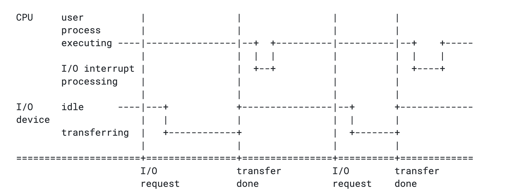
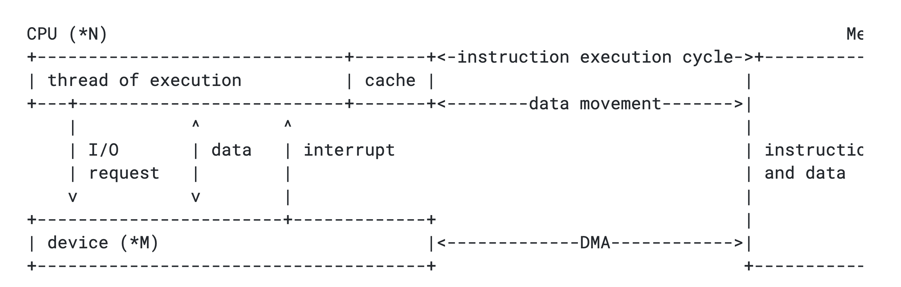
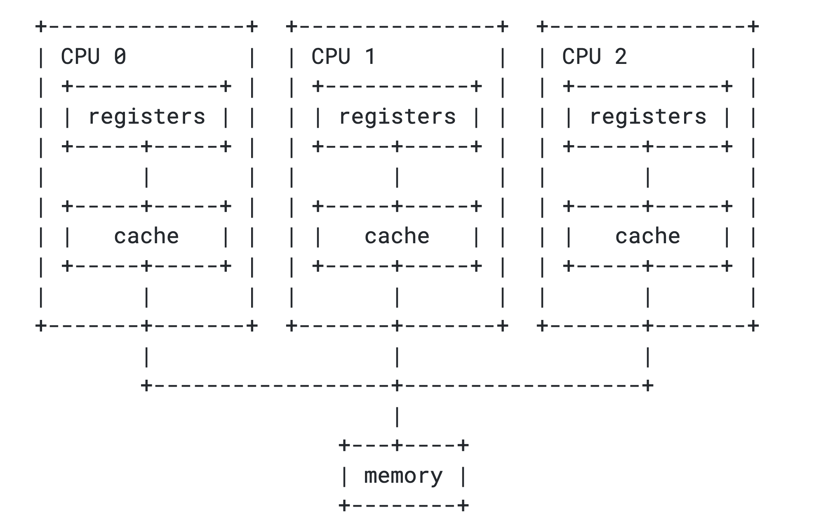

# What Operating Systems Do

운영체제(Operating System)는 컴퓨터의 하드웨어를 관리하고, 하드웨어와 소프트웨어, 사용자를 매개하는 프로그램이다.

커널(Kernel)은 운영체제의 핵심이며, 실체다.

운영체제는 커널과 커널 모듈(Kernel module)들로 구성되는데, 커널이 운영체제의 핵심이다보니 일반적으로 운영체제와 커널은 동일시 된다.

커널이 같다면 같은 운영체제로 취급한다.

컴퓨터 시스템의 요소는 하드웨어(CPU, 메모리, 입출력장치 등), 운영체제, 어플리케이션 프로그램(웹 브라우저, 워드프로세서 등), 유저로 나뉜다. 운영체제는 정부와 비슷하다.

정부 그 자체만으로는 쓸모있는 기능을 못하지만, 사람들에게 더 나은 환경을 제공한다. 마찬가지로 운영체제는 프로그램들이 유용한 일을 할 수 있는 환경을 제공한다.

운영체제의 역할은 사용자 관점(User View)과 시스템 관점(System View)으로 나눠볼 수 있다.

## User View

일반적으로 사용자는 컴퓨터 앞에 앉아 키보드와 마우스를 조작한다.

이 경우 운영체제는 사용자가 컴퓨터 자원 사용(Resource utilization)을 신경쓰지 않게 도우며, 사용자가 컴퓨터를 쉽게 이용할 수 있도록 만든다.

또 다른 경우, 사용자는 메인프레임(Mainframe)에 연결된 터미널을 사용하거나 미니컴퓨터(Minicomputer)를 사용한다.

이 상황에서는 컴퓨터의 자원을 여러 사용자가 나눠쓰게 되는데, 운영체제는 사용자들이 자원을 공평하게 사용할 수 있도록 돕는다.

## System View

시스템에게 운영체제는 자원 할당자(Resource allocator)다.

컴퓨터 시스템은 CPU 시간, 메모리 공간, 파일 저장소 공간, 입출력 장치 등 다양한 문제를 해결해야 한다.

운영체제는 이러한 컴퓨터 자원들을 관리하는 제어 프로그램(Control program)으로서 동작한다.

## Computer-System Organization

현대의 일반적인 컴퓨터 시스템은 여러개의 CPU와 장치 컨트롤러(Device controllers)로 구성되어 있다.

그리고 이들은 공통버스(Commmon bus)로 이어져 메모리를 공유한다.


## Computer Startup

컴퓨터를 켜면 부트스트랩 프로그램(Bootstrap program)이라는 초기화 프로그램이 실행된다.

이 프로그램을 컴퓨터의 ROM(Read-Only Memory)이나 EEPROM(Electrically Erasable Programmable Read-Only Memory)에 저장되어 있으며, 주로 펌웨어(Firmware)라고 불린다.

부트스트랩 프로그램은 시스템을 초기화하고, 부트로더(Boot loader)를 실행한다.

(멀티부팅 컴퓨터의 경우 부트로더가 여러 운영체제를 가리키고 있는데, 이 경우엔 어떤 운영체제를 실행할지 선택해야 한다.) 그리고 부트로더는 최종적으로 운영체제를 실행하게 된다.

커널이 로드, 실행되면 시스템과 사용자에게 서비스를 제공해야 한다.

이때 일부 서비스는 커널 외부에서 제공되는데, 이들은 부팅할 때 메모리에 로드되는 시스템 프로세스(System processes)나 시스템 데몬(System daemons)이다.

UNIX의 경우 첫 시스템 프로세스는 init이며, 이 프로세스는 또 다른 데몬들을 실행시킨다. 데몬은 프로세스로 백그라운드에서 돌면서 시스템 로그는 남기는 등의 여러 작업을 한다.

이러한 과정이 끝나면 시스템이 완전히 부팅되고, 이벤트가 발생하기를 기다리게 된다.

## Computer-System Operation

입출력 장치와 CPU는 동시에 실행될 수 있다.

장치 컨트롤러는 CPU에게 이벤트 발생을 알리는데, 이벤트 발생을 알리는 것을 인터럽트(Interrupt)라고 부른다.

인터럽트는 '방해하다’라는 뜻인데, 컴퓨터에서는 신호를 보내 이벤트 발생을 알리는 것을 의미한다. 보통 컴퓨터는 여러 작업을 동시에 처리하는데, 이때 당장 처리해야 하는 일이 생겨서 기존의 작업을 잠시 중단해야 하는 경우 인터럽트 신호를 보낸다.

그러면 커널은 작업을 멈추고 인터럽트를 처리한 뒤 다시 기존 작업으로 돌아온다.



인터럽트는 하드웨어나 소프트웨어에 의해 발생할 수 있으며, 소프트웨어에 의해 발생하는 인터럽트는 **트랩(Trap)**이라고 부른다.

하드웨어의 경우 시스템 버스(System bus)를 통해 CPU에 신호를 보냄으로써 인터럽트를 발생시키고,

소프트웨어는 시스템 콜(System call)이라는 특별한 명령으로 인터럽트를 발생시킨다.

## Common Functions of Interrupts

보통 컴퓨터는 여러 작업을 동시에 처리하는데, 만약 CPU가 인터럽트 신호를 받으면, 앞서 말했듯이 하던 일을 잠시 멈추고 메모리의 어떤 고정된 위치(Fixed location)를 찾는다.

이 위치는 인터럽트 벡터(Interrupt vector)에 저장되어 있다.

인터럽트 벡터는 인터럽트를 처리할 수 있는 서비스 루틴(Service routine)들의 주소를 가지고 있는 공간으로, 파일 읽기/쓰기와 같은 중요한 동작들이 하드코딩되어 있다.

이렇게 인터럽트를 처리하고나면 CPU는 다시 원래 작업으로 돌아온다.

이 과정은 사용자가 눈치채지 못할 정도로 매우 빠르게 일어날 수도 있고, 너무 느려서 오랜 시간을 기다려야 할 수도 있다.

참고로 어떤 값을 0으로 나누는 것(Division by zero)도 인터럽트이며, 이러한 내부 인터럽트(Internal interrupt)는 예외(Exception)라고 부른다.

## Interrupt Handling

현대 운영체제들은 대부분 인터럽트 주도적(Interrupt driven)이다.

인터럽트가 발생하기 전까지 CPU는 대기상태에 머문다.

반면 폴링(Polling)의 경우 주기적으로 이벤트를 감시해 처리 루틴을 실행한다.

이렇게 하면 컴퓨팅 자원을 낭비하게 되기 때문에 인터럽트 주도적으로 설계하는 것이다.

## Storage Structure

커널은 실행기(Executor)를 통해 프로그램을 실행시킨다.

실행기는 기억장치(Storage)에서 exe파일(Windows의 경우)을 가져오고, 커널이 이것을 메모리에 할당해 실행시킨다.

이처럼 모든 프로그램은 메인 메모리에 로드되어 실행되며, 메인 메모리는 보통 RAM(Random-Access Memory)이라고 부른다.

하지만 RAM은 모든 프로그램을 담기엔 너무 작고 비싸다.

또한 전원이 나가면 저장된 데이터가 모두 사라지는 휘발성(Volatile) 장치다.

그래서 보조기억장치(Secondary storage)가 필요하다.

자기테이프(Magnetic tapes), 광학디스크(Optical disk), 자기디스크(Magnetic disk), SSD(Soli-State Disk)는 비휘발성(Non-volatile) 기억장치다.

반면 메인 메모리, 캐시(Cache), 레지스터(Registers)는 휘발성 기억장치다.

보조기억장치는 용량이 크고 저렴한 반면, 캐시나 레지스터는 용량이 작고 비싸다.

요즘 컴퓨터에는 최대절전 모드가 있는데, 이 방식이 꽤 재밌다.

컴퓨터가 절전모드에 들어가면 메모리의 모든 데이터를 덤프해서 보조기억장치에 담아두고, 다시 절전모드 빠져나오면 덤프해둔 데이터를 불러와 그대로 작업을 수행한다.

영어로는 하이버네이트(Hibernate)라고 한다.

## I/O Structure

기억장치는 여러 입출력장치(I/O devices) 중 하나일 뿐이다.

컴퓨터는 다양한 입출력 장치를 가지고 있으며, 입출력 컨트롤러는 각각 다른 장치를 담당한다.

컴퓨터는 이 컨트롤러 덕분에 다양한 장치를 사용할 수 있다. 또한 운영체제는 각 장치 컨트롤러를 제어하기 위한 장치 드라이버(Device driver)를 가지고 있다.

입출력 명령을 수행하기 위해 장치 드라이버는 장치 컨트롤러의 레지스터를 로드한다.

장치 컨트롤러는 레지스터에서 "키보드로부터 문자 읽어오기"와 같은 동작을 읽고, 장치에서 로컬 버퍼(Local buffer)로 데이터를 전송하기 시작한다.

데이터의 전송이 끝나면 장치 컨트롤러는 장치드라이버에게 인터럽트를 보내 동작이 끝났음을 알리고, 장치 드라이버는 통제권을 운영체제에게 돌려준다. 이때 입력받은 데이터나 상태 정보를 넘겨주기도 한다.

사용자 프로그램은 커널과 사용자 프로그램을 매개하는 인터페이스인 시스템 콜(System call)을 통해 입출력을 요청할 수 있다.

## Direct Memory Access Structure

과거에는 장치 데이터를 처리하기 위해 CPU를 거쳐 메모리에 로드하는 방식을 사용했으나, CPU 자원이 너무 많이 소모되기 때문에 이젠 DMA(Direct Memory Access)를 사용한다.

DMA는 장치와 메모리를 직접 연결하는 방식으로, 버스가 지원하는 기능이다.

메모리의 일정 부분은 DMA에 사용될 영역으로 지정되며, DMA를 제어하는 컨트롤러는 DMA 컨트롤러라고 부른다.

참고로 CPU를 거치는 방식은 PIO(Programmed I/O)라고 부른다.

장치의 데이터는 장치 컨트롤러에 의해 직접 메모리에 전달되며, CPU에서는 데이터 이동이 완료되었다는 인터럽트만 한 번 일어난다. 이렇게 하면 결과적으로 CPU가 하는 일이 줄어드니까 성능이 좋아진다.

## Computer-System Architecture

현대 컴퓨터 시스템은 기본적으로 폰 노이만 구조를 따른다.



### Single-Processor Systems

과거 대부분의 컴퓨터는 싱글 프로세서를 사용했다. 싱글 프로세서 컴퓨터에는 하나의 메인 CPU만 탑재되며, 장치에 따라 특별한 목적을 가진 프로세서가 들어갔다. 가령 디스크 프로세서는 디스크 연산만 수행하고, 키보드 프로세서는 키보드 연산만 수행하는 식이다.

### Multiprocessor Systems

멀티 프로세서 시스템은 이젠 일반적인 컴퓨터 시스템이 되었다.

멀티 프로세서 컴퓨터는 2개 이상의 프로세서를 가지고 있다.

처음에는 서버 컴퓨터에 처음 적용됐는데, 지금은 모바일 기기도 멀티 프로세서 시스템으로 만들어진다.

멀티 프로세서 시스템은 몇가지 장점을 가지고 있다.

처리량(Throughput)의 증가: 당연하겠지만 프로세서가 늘어나면 더 빠른 시간 안에 연산을 수행할 수 있다.

물론 프로세서를 계속 늘린다고 성능이 한없이 좋아지는 것은 아니며, 증가 비율이 1:1인 것도 아니다.
규모의 경제: 멀티 프로세서 시스템은 여러 대의 싱글 프로세서 시스템을 구축하는 것보다 돈이 적게 든다.

멀티 프로세서 시스템은 주변장치(Peripherals)를 공유할 수 있기 때문이다.

신뢰성의 증가: 만약 기능이 여러 프로세서에 분산될 수 있다면, 하나의 프로세서가 작동을 멈춰도 전체 시스템은 느려질 뿐 멈추지 않는다.

이런 식으로 성능이 나빠지지만 작동은 가능하도록 하는 것을 우아한 성능저하(Graceful degradation)라고 부른다.

그리고 이렇게 성능을 저하함으로써 작업을 계속 유지하는 시스템을 장애 허용 시스템(Fault tolerant)이라고 부른다.

멀티 프로세서 컴퓨터는 2개 이상의 프로세서를 가지고 있다.

멀티 프로세서 시스템은 비대칭 멀티프로세싱(Asymmetric multiprocessing)과 대칭 멀티프로세싱(Symmetric multiprocessing) 두 가지로 나뉜다.

비대칭 멀티프로세싱은 관료주의적인 회사다.

보스 프로세서(Boss processor)가 시스템을 제어하고, 다른 프로세서들은 보스의 지시를 받게 된다.

이렇게 하면 부하 분산(Load balancing)을 효율적으로 할 수 있다.

대신 보스 프로세서가 작동을 멈추면 일꾼 프로세서들도 멈추게 된다.

대칭 멀티프로세싱은 보스가 없는 자유로운 회사다.

모든 프로세서들은 하나의 메모리를 공유하고, 동일한 작업을 병렬적으로 수행한다.

만약 프로세서에 이상이 생겨 작동을 멈춰야 한다면 자신이 수행하던 작업을 다른 프로세서들에게 나눠주고 자신만 재부팅한다.

재부팅 후 문제가 해결된다면 다시 작업을 나눠 받는다. 비대칭 멀티프로세싱 시스템의 단점을 보완할 수 있는 아키텍처이기 때문에 대부분의 컴퓨터 시스템은 대칭 멀티프로세싱을 사용한다.

멀티 프로세서 시스템의 CPU들은 각자의 레지스터와 캐시를 갖고 있다. 만약 CPU가 여러 개라면 돌아가면서 작업을 해야 하는데, 그러면 다른 CPU가 작업을 하는 동안 다른 CPU들은 놀게 된다.



## A Dual-Core Design

CPU가 늘어나면 프로세서간 통신을 하는 데 많은 비용이 들기 때문에 효율이 계속 좋아지지는 않는다. x축을 CPU 수, y축을 성능이라고 하면 그래프는 로그함수 형태로 나타난다. 조별 과제를 생각해보자. 내 아이큐 150, 네 아이큐 150을 합치면 총 300이지만, 머리가 많다고 좋은 것은 아니다. 사람이 늘어날수록 커뮤니케이션의 어려움은 커진다.

최근 CPU 설계 트렌드는 하나의 칩(Chip)에 코어(Cores)를 늘리는 것이다.

이러한 멀티 프로세서 시스템을 멀티코어(Multicore)라고 부른다.

코어는 동일한 성능의 CPU 여러 개를 1개의 칩 속에 집접한 것이라고 보면 된다.

칩 내부의 통신(On-chip communication)이 칩 사이의 통신(Between-chip communication)보다 더 빠르기 때문에 여러 개의 칩에 하나의 코어만 두는 시스템보다 더 효율적이다.

뿐만 아니라 하나의 칩에 여러 코어를 담으면 전력을 더 적게 사용한다.


위 다이어그램은 듀얼 코어 시스템이다.

각 코어는 자신만의 레지스터와 로컬 캐시를 갖는다. (하나의 캐시를 공유하기도 한다.)

## Clustered Systems

멀티프로세서 시스템의 일종인 클러스터 시스템(Clustered system)은 여러개의 CPU을 모아 놓은 구조다.

클러스터 시스템은 여러개의 개별 시스템(또는 노드)들이 하나로 모여있다는 점에서 앞서 설명한 멀티프로세서 시스템과는 조금 다르다.

멀티프로세서 시스템은 여러CPU가 하나의 시스템을 이루는 것이지만, 클러스터 시스템은 여러 독립적인 시스템이 모여 하나의 시스템을 이루는 것이다.

이런 시스템을 약결합(Loosely coupled)라고 부르며, 각 노드들은 싱글 프로세서 시스템일수도 있고, 멀티코어 시스템일 수도 있다.

클러스터의 정의가 딱 명확히 정해져 있지는 않다.

단지 클러스터 컴퓨터들이 하나의 저장소를 공유하고, 이를 LAN(Local-Area Network)과 같은 네트워크로 연결한 시스템을 보통 클러스터 시스템이라고 부른다.

클러스터링은 고가용성(High-availability) 서비스를 제공하기 위해 사용되며, 단일 컴퓨터보다 훨씬 저렴하게 비슷한 성능을 낼 수 있다.

클러스터 시스템은 비대칭 클러스터링(Asymmetric clustering)과 대칭 클러스터링(Symmetric clustering)으로 나뉜다.

비대칭 클러스터링에서 하나의 장비는 상시 대기 모드(Hot-standby mode)로 작동하며, 서버를 동작시키고 있는 다른 노드들을 모니터링할 뿐 별도의 작업은 수행하지 않는다.

만약 서버에 문제가 생기면 이 상시 대기 노드가 서버로서 작동하게 된다. 대칭 클러스터링은 두개 이상의 노드가 작업을 수행하는 동시에 다른 노드들을 모니터링하는 구조다. 이러한 구조는 하드웨어의 자원을 최대로 사용할 수 있어 더 효율적이다.

클러스터 시스템은 여러개의 컴퓨터 시스템이 네트워크로 연결되어 있는 구조이기 때문에 고성능 컴퓨팅 환경(High-performance computing environments)을 제공할 수 있다. 다만 단일 시스템에 비해 유지보수가 힘들고, 시스템의 성능이 네트워크 환경에 많은 영향을 받는다는 단점이 있다.

## Operating System Structure

운영체제의 가장 중요한 부분 중 하나는 멀티프로그램(Multiprogram) 능력이다.

멀티프로그래밍(Multiprogramming)은 여러 프로그램을 메모리에 로드해 두고 한 프로세스가 대기 상태가 되면 다른 프로세스의 작업을 수행하는 시스템이다. 이렇게 하면 CPU의 사용 효율을 높일 수 있다.

여기서 더 확장된 시스템이 시분할(Time sharing) 시스템이다.

다른 말로는 멀티태스킹(Multitasking)이라고도 부른다.

이는 프로세스마다 작업 시간을 정해두고 번갈아가면서 작업하는 방식이다.

프로세스들이 빠르게 번갈아가며 메모리를 사용하면 사용자 입장에서는 마치 동시에 작동하는 것처럼 보이게 된다. 이때는 반응 시간(Response time)을 줄이는 것이 중요하다.

시분할 시스템과 멀티프로그래밍 시스템은 여러 작업들을 동시에 메모리에 올리는 방식이다.

때문에 운영체제는 메모리에 자리가 없는 경우를 고려해 어떤 작업을 먼저 처리할지 정해야한다.

이러한 과정을 작업 스케줄링(Job scheduling), CPU 스케줄링(CPU Scheduling)이라고 하는데, 이건 5장에서 다룬다.

만약 메모리를 너무 많이 사용하게 되는 경우, 반응 시간을 줄이기 위해 가상 메모리(Virtual memory)를 사용한다.

가상 메모리는 보조기억장치의 일부를 메인 메모리처럼 사용하는 기술로, 실제 물리 메모리(Physical memory)보다 더 큰 프로그램을 구동할 수 있도록 해준다.

## Operating-System Operations

앞서 언급했듯이 운영체제는 인터럽트 주도적이다. 인터럽트가 없다면 시스템은 조용히 인터럽트를 기다린다. 만약 사용자의 프로그램이 멋대로 하드웨어에 접근해 인터럽트를 보낸다면 큰 문제가 생기길 것이다. 운영체제와 사용자는 컴퓨터의 하드웨어, 소프트웨어 자원을 공유하기 때문에 사용자 프로그램이 오류를 일으키지 않도록 방지해야 한다.

## Dual-Mode and Multimode Operation

운영체제는 사용자 프로그램이 함부로 시스템에 접근하지 못하도록 모드(Mode)를 나눠둔다. 유저 모드(User mode)와 커널 모드(Kernel mode)가 그것이며, 하드웨어의 모드 비트(Mode bit)가 0은 커널 모드, 1은 유저 모드임을 가리킨다.

## kernel

이러한 이중 모드(Dual-mode) 방식을 사용하면 나쁜 의도를 가진 사용자로부터 운영체제, 하드웨어를 비롯한 시스템과 사용자를 보호할 수 있다.

하드웨어는 커널 모드일 때만 특권 명령(Privileged instructions)를 실행한다.

만약 유저 모드에서 특권 명령을 실행하려 한다면 하드웨어는 이 동작을 막고 운영체제에게 트랩을 보낼 것이다.

유저 모드에서 합법적으로(?) 커널 모드의 기능을 호출하고 싶다면 시스템 콜(System call)이라는 인터페이스를 통해야 한다.

## Timer

운영체제는 사용자의 프로그램이 제어권을 운영체제에게 넘겨주지 않는 상황을 방지하기 위해 타이머(Timer)를 사용한다.

타이머는 운영체제에게 제어권을 보장하기 위해 특정 주기에 인터럽트를 발생시킨다.

운영체제는 카운터를 설정하고, 매 틱(Ticks)마다 감소시킨다. 그렇게 카운터가 0에 도달하면 인터럽트가 발생한다.

## Process Management

디스크에 있으면 프로그램, 메모리에 로드되면 프로세스다.

프로그램은 하나지만 프로세스는 여러 개일 수 있다.

강조할 점은, 프로그램은 디스크에 저장되어 있는 수동적(Passive) 존재인 반면 프로세스는 능동적(Active) 존재다.

또한 프로세스는 프로그램이 어디까지 실행되었는지 북마크하는 프로그램 카운터(Program counter)를 가지고 있다.

싱글쓰레드(Single-thread) 프로세스는 하나의 프로그램 카운터를 가지고 있으며, 멀티쓰레드(Multi-threads) 프로세스는 여러개의 프로그램 카운터를 가지고 있다.

운영체제는 프로세스 관리를 위해 CPU에게 프로세스와 쓰레드를 스케줄링하고, 프로세스를 생성하거나 제거하는 활동을 한다. 뿐만 아니라 일시정지하거나 재실행하고, 프로세스의 동기화(Synchronization)와 통신도 제공한다.

## Memory Management

메인 메모리는 현대 컴퓨터 시스템의 핵심이며, 방대한 바이트의 배열이다.

그리고 각 바이트는 그들만의 주소를 가지고 있다.

이후 프로그램이 실행될 때 프로그램은 절대 주소(Abolute addresses)로 매핑(Mapping)되어 메모리에 로드된다. 메모리 관리는 여러 요인을 고려해야 하는 작업이며, 특히 시스템의 하드웨어 설계를 신경써야 한다.

운영체제는 메모리 관리를 위해 메모리의 어떤 부분이 어디에 쓰이는지, 누가 사용하는지 추적하고, 어떤 프로세스와 데이터가 메모리의 안팎으로 옮겨질지 결정한다. 또한 메모리 공간을 할당하고 해제하는 것도 운영체제가 하는 일이다.

## Storage Management

운영체제는 저장장치의 물리적 속성을 추상화해 파일(File)이라는 논리적 저장 단위로 정의하며, 파일을 물리적 매체(Physical media)에 담거나 저장장치의 파일에 접근하기도 한다.

## File-System Management

파일 관리는 운영체제가 하는 일 중 가장 눈에 잘 보이는 요소다. 운영체제는파일을 생성, 제거하며, 당연히 읽기, 쓰기도 한다.

## Mass-Storage Management

프로그램은 디스크에 담겨 있으며, 메인 메모리에 로드되어 실행된다.

많은 사람들이 제3의 저장 장치(Tertiary storage devices)를 사용한다.

저장 장치들은 WORM(Write-Once, Read-Many-Times)과 RW(Read-Write) 형식에 차이가 있다. 한번쯤 봤을 NTFS, FAT가 파일 저장 형식이며, 이를 파일 시스템(File system)이라고 부른다. 파일 시스템이 다르면 읽기는 가능하지만 쓰기가 불가능하다.

## Caching

캐싱(Caching)은 컴퓨터 시스템에 있어 정말 중요한 부분이다.

캐시는 굉장히 빠르고 작은 저장장치이며, 캐싱은 캐시 메모리를 사용해 컴퓨터의 속도를 높이는 기술이다.

데이터를 디스크에서 직접 가져오는 것은 너무 느리기 때문에 캐시에 자주 사용될 것 같은 데이터를 미리 담아두고, CPU나 디스크가 캐시의 데이터를 참조할 수 있도록 한다.

파일의 중복성이 증가하지만, 속도 역시 증가한다.

캐싱은 지역성(Locality) 원리를 사용한다.

지역성은 시간지역성(Temporal locality)과 공간지역성(Spatial Locality)으로 나뉜다.

시간지역성은 한 번 접근한 데이터에 다시 접근할 확률이 높다는 것이다.

공간지역성은 특정 데이터와 가까운 메모리 주소에 있는 다른 데이터들에도 접근할 가능성이 높다는 것이다.

```
for (int i = 0; i < 10; i++) { ... }
```

위 코드에서 변수 i가 그 예시다.

공간지역성은 특정 데이터와 가까운 메모리 주소에 있는 다른 데이터들에도 접근할 가능성이 높다는 것이다. 다음 코드를 보자.

```
for (int i = 0; i < 10; i++) {
arr[i] += 1;
}
```

배열 변수 arr의 0번 요소부터 순서대로 9번 요소까지 접근한다.

메모리 공간에 배열의 요소들은 그 순서대로 붙어 할당되니까 실제로 가까운 메모리 공간에 연속적으로 접근하고 있다.

캐시는 한 메모리 주소에 접근했을 때 그 주변의 메모리 주소도 함께 가져온다.

캐시에 대한 보다 자세한 내용은 캐시가 동작하는 아주 구체적인 원리에서 설명했다.

## I/O System

운영체제는 모든 입출력장치를 파일로 취급한다. 오직 장치드라이버(Device driver)만이 장치의 자세한 정보를 알고 있다.

## Protection and Security

컴퓨터 시스템은 여러 사람들이 사용하기 때문에 보호와 보안도 매우 중요하다.

운영체제는 내외부로부터 컴퓨터를 위험하게 만드는 요소를 막기 위해 다양한 활동을 한다.

(유저 모드와 커널 모드를 나눈 것도 보호의 일종이다.

권한 확대(Privilege escalation)는 컴퓨터 시스템의 권한을 여러 층으로 나누고, 사용자의 권한을 구분해 어떤 행동이나 기준에 따라 사용자의 권한을 상승시키는 시스템이다.

참고로 권한 확대는 수직 권한 확대와 수평 권한 확대로 나눌 수 있는데, 가령 임의의 코드를 실행시켜 더 높은 권한을 얻는 행위는 수직 권한 확대, 안드로이드 루팅, iOS 탈옥은 수평 권한 확대라고 한다.

## Kernel Data Structures

커널 구현에는 기본적인 리스트(List), 스택(Stack), 큐(Queue), 링크드리스트(Linked list) 등의 자료구조가 사용된다. 특히 트리(Tree)는 상당히 효율적인 O(logn)의 시간복잡도를 가질 수 있기 때문에 자주 사용된다.

## Computing Environments

모바일 컴퓨팅(Mobile computing) 환경은 컴퓨터의 접근성을 높였고, 다양한 센서를 통해 사용자와의 인터페이스를 확장시켰다.

또한 분산형 컴퓨팅(Distributed computing), 클라이언트-서버 컴퓨팅(Client-Server computing), P2P 컴퓨팅(Peer-to-Peer computing) 등 다양한 컴퓨팅 환경이 있다.

특히 클라우드 컴퓨팅(Cloud computing)은 AWS(Amazon Web Service)를 통해 상당히 잘 알려졌다. 현대 컴퓨팅 환경의 가장 큰 특징을 꼽자면 휴대성, 가상화, 멀티코어가 있다.

## Open-Source Operating Systems

세상에는 많은 오픈소스 운영체제들이 있다.

당장 깃허브에서도 리눅스의 코드를 찾아볼 수 있다.

오픈소스 운영체제 개발에는 누구나 참여할 수 있고, 이를 이용해 새로운 운영체제를 만들 수도 있다.

본격적으로 프로세스에 대해서 다루기 시작한다.

디스크에 있는 것은 프로그램, 메모리에 로드된 것은 프로세스라고 한다.

프로세스는 Stack, Heap, Data, Code로 나뉜다.

프로세스의 상태는 현재 활동에 따라 달라진다.

- New: 프로세스가 처음 생성되었을 때.
- Ready: 프로세스가 프로세서에 할당되기를 기다릴 때.
- Running: 프로세스가 할당되어 실행될 때.
- Waiting: 프로세스가 이벤트를 기다릴 때.
- Terminated: 프로세스가 실행을 마쳤을 때.

## Process Control Block (PCB)

각각의 프로세스는 자신의 정보 묶음인 PCB를 가지고 있다. PCB에는 프로세스 상태와 프로그램 카운터, 메모리 한계, 레지스터 정보 등이 담겨있다.

- Process state: 프로세스의 상태.
- Program counter: 해당 프로세스가 이어서 실행해야 할 명령의 주소를 가리키는 카운터.
- CPU registers: 프로세스가 인터럽트 이후 올바르게 작업을 이어가기 위해 참조하는 CPU 레지스터 값.
- CPU-scheduling information: 프로세스의 중요도, 스케줄링 큐 포인터 등 스케줄링 파라미터 정보.
- Memory-management information: base, limit 레지스터 값, 페이지 테이블 등 메모리 시스템 정보.
- Accounting information: 사용된 CPU 총량, 프로세스 개수, 시간 제한 등.
- I/O status information: 프로세스에 할당된 입출력 장치 목록, 열린 파일 목록 등.

## Theads

프로세스를 쪼개 하나의 프로세스 안에서 동시에 여러 작업을 처리할 수 있다.

지금까지는 싱글 스레드 프로세스를 전제하고 살펴봤다.

싱글 스레드 프로세스는 한번에 하나의 작업만 할 수 있다.

가령 워드 프로세서 프로그램을 실행한다면, 글자를 타이핑할 때 같은 프로세스 안에서 동작하는 문법 교정기가 동시에 동작할 수 없다.

## Process Scheduling

멀티프로그래밍의 목적은 CPU를 최대로 사용하기 위해 항상 일부 프로세스를 실행하는 것이다.

타임쉐어링의 목적은 프로세스 간에 CPU를 자주 전환함으로써 사용자가 각 프로그램이 실행되는 동안 서로 상호작용할 수 있도록 만드는 것이다.

이러한 목적을 달성하기 위해 프로세스 스케줄러는 CPU에서의 프로그램을 실행을 위해 사용 가능한 프로세스를 선택하며, 어떤 프로세스를 프로세서에 할당할 것인가 결정하는 일을 프로세스 스케줄링이라고 한다.

## Scheduling Queues

프로세스가 시스템에 들어오면 잡 큐(Job queue)에 들어간다.

잡 큐는 시스템의 모든 프로세스로 구성되어있다.

메인 메모리에서 실행을 기다리는 ready 상태의 프로세스들은 레디 큐(Ready queue)에 쌓인다. 입출력 장치를 기다리는 프로세스들은 디바이스 큐(Device queue)로 들어간다.

## Schedulers

레디 큐에 프로세스를 옮기는 것은 잡 스케줄러, 또는 Long-term 스케줄러라고 한다.

프로세스를 프로세서에 할당하는 것은 CPU 스케줄러, 또는 Short-term 스케줄러라고 한다.

Long-term 스케줄러는 CPU 밖에서 가끔 수행된다. Short-term 스케줄러는 그 반대다.

## Context Switch

프로세스가 실행되다가 인터럽트가 발생해 운영체제가 개입하여 프로세서에 할당된 프로세스를 바꾸는 것을 말한다.

시스템 콜을 사용해야 하는 경우 프로세스가 자체적으로 처리할 수 없기 때문에 운영체제가 개입해야 한다.

프로세서가 다른 프로세스로 스위치할 때, 시스템은 작업중이던 프로세스의 상태를 저장하고 새로운 프로세스의 상태를 로드한다.

컴퓨터과학에서 컨텍스트는 내 시스템에서 활용 가능한 모니터링된 정보들을 의미한다.

프로세서 입장에서 컨텍스트는 PCB이기 때문에 PCB 정보가 바뀌는 것을 컨텍스트 스위치라고 부른다. 컨텍스트 스위치는 오버헤드가 발생하는 작업이기 때문에 너무 자주 일어나면 성능을 저하한다.

## Operations on Processes

대부분의 시스템에서 프로세스는 동시에 실행될 수 있고, 이들은 동적으로 생성되거나 삭제될 수 있다. 시스템은 프로세스 생성, 삭제 메커니즘을 제공해야 한다.

## Process Creation

프로세스는 트리 구조로 되어 있다.

즉, 부모 프로세스가 자식 프로세스를 만든다.

PCB에 저장된 pid값으로 프로세스를 식별하는데, 이는 운영체제가 정해준 고유 번호다.

프로세스 생성은 플라나리아 번식과 유사하다.

시스템 콜의 fork() 함수를 호출하면 부모 프로세스는 자신과 똑같은 자식 프로세스를 생성한다.

자식 프로세스는 exec()를 통해 내용을 모두 바꾼다.

fork() 함수는 부모 프로세스에겐 자식 프로세스의 pid를, 자식프로세스에겐 0을 반환한다. 부모 프로세스와 자식 프로세스는 동시에 작동한다.

## Process Termination

exit()를 호출하면 프로세스를 종료시킬 수 있다.

부모 프로세스가 자식 프로세스보다 먼저 종료되면 자식 프로세스는 그 상위 프로세스를 부모 프로세스로 바라본다.

자식 프로세스가 종료되었는데, 부모 프로세스가 자식 프로세스가 반환한 정보를 회수하지 않으면 자식 프로세스는 종료되었음에도 정보가 메모리에 남아 있는 좀비 프로세스가 된다.

## Interprocess Communication (IPC)

프로세스는 독립적으로 동작하거나 서로 협력하며 동작할 수 있다.

협력하는 프로세스들은 통신하며 서로에게 영향을 미친다. IPC 모델에는 메시지 패싱(Message passing)과 공유 메모리(Shared memory)가 있다.

## Message Passing

메시지 패싱은 우편이다.

송신 프로세스가 정보를 받는 수신 프로세스에게 커널을 통해 정보를 전달하며, 수신 프로세스도 커널에 접근해 정보를 수신한다.

메시지 패싱은 컨텍스트 스위치가 발생하기 때문에 속도가 느리다. 다만 커널이 기본적인 기능을 제공하므로 공유 메모리 방식에 비해선 구현이 쉽다.

## Shared Memory

공유 메모리는 게시판이다.

특정 메모리 공간을 두 프로세스가 함께 사용하며 정보를 주고 받는다.

커널을 거치지 않기 때문에 속도가 빠르지만 메모리에 동시 접근하는 것을 방지하기 위해 프로그래머가 따로 구현을 해줘야 한다.

## Producer-Consumer Problem

협력하는 프로세스 중 정보를 생산하는 프로세스를 생산자(Producer), 정보를 소비하는 프로세스를 소비자(Consumer)라고 부른다.

생산자-소비자 문제는 두 프로세스가 동시에 동작할 때 일어나는 이슈를 말한다.

보통 정보가 생산되는 속도가 소비하는 속도보다 빠르기 때문에 동기화 문제가 발생하는데, 이를 해결하기 위해 생산된 데이터를 담아두는 버퍼(Buffer)를 사용한다.

크기에 한계가 있는 버퍼를 유한 버퍼(Bounded buffer), 버퍼의 시작과 끝을 이어붙여 크기가 무한한 버퍼를 무한 버퍼(Unbounded buffer)라고 한다.

## Synchronization

메시지 패싱의 동기화 문제를 해결하기 위해 blocking 방식과 non-blocking 방식이 사용된다.

- Blocking send: 수신자가 메시지를 받을 때까지 송신자는 block된다.
- Blocking receive: 메시지를 수신할 때까지 수신자는 block된다.
- Non-blocking send: 송신자가 메시지를 보내고 작업을 계속한다.
- None-blocking receive: 수신자가 유효한 메시지나 Null 메시지를 받는다.

## Sockets

소켓은 서버와 클라이언트가 통신하는 방식이다.

IP주소와 포트 정보가 있으면 클라이언트는 네트워크를 통해 서버 프로세스에 접근할 수 있다.

RPC(Remote Procedure Calls)는 프로세스와 프로세스가 네트워크로 이어져 있을 때 발생하는 호출을 말한다.

서버와 클라이언트가 통신할 때는 IP주소와 포트를 래핑해서 Stub으로 만들어 전송한다.

## Pipes

파이프는 부모 프로세스와 자식 프로세스가 통신할 때 사용하는 방식이다.

말 그대로 프로세스 사이에 파이프를 두고 정보를 주고 받는 건데, 파이프는 단방향 통신만 가능하기 때문에 양방향으로 정보를 주고 받으려면 두 개의 파이프가 필요하다.

(파이프는 파일이다.)

파이프에 이름을 붙인 named pipe를 사용하면 꼭 부모-자식 관계가 아니더라도 파이프를 이용해 통신할 수 있다.

## Threads

스레드는 프로세스의 작업 흐름을 말한다.

하나의 프로세스가 한 번에 하나의 작업만 수행하는 것은 싱글스레드(Single thread)이며, 하나의 프로세스가 동시에 여러 작업을 수행하는 것은 멀티스레드(Multi thread)라고 한다.

프로세서와 메모리가 발전하며 가능해진 기술이다. 멀티프로그래밍 시스템이니까 프로세스를 여러개 돌려도 되는데 굳이 스레드를 나누는 데는 이유가 있다.

두 프로세스가 하나의 데이터를 공유하려면 메시지 패싱이나 공유 메모리 또는 파이프를 사용해야 하는데, 효율도 떨어지고 개발자가 구현, 관리하기도 번거롭다.

프로세스 사이 컨텍스트 스위치가 계속 일어나면 성능 저하가 발생한다. 스레드 전환에도 컨텍스트 스위치가 일어나지만 속도가 더 빠르다.

## Multithreaded Server Architecture

서버와 클라이언트 사이에도 멀티스레드를 구현한다.

클라이언트가 서버에게 요청을 보내면 서버는 새로운 스레드를 하나 생성해 요청을 수행한다. 프로세스를 생성하는 것보다 스레드를 생성하는 것이 더 빠르기 때문이다.

## Multicore Programming

이렇게 멀티코어 또는 멀티프로세서 시스템을 구현할 때는 동시성(Concurrency)와 병렬성(Parallelism)을 알아야 한다.

동시성은 싱글 프로세서 시스템에서 사용되는 방식으로, 프로세서가 여러 개의 스레드를 번갈아가며 수행함으로써 동시에 실행되는 것처럼 보이게 하는 방식이다.

병렬성은 멀티코어 시스템에서 사용되는 방식으로, 여러 개의 코어가 각 스레드를 동시에 수행하는 방식이다.

## User Threads and Kernel Threads

유저 스레드는 사용자 수준의 스레드 라이브러리가 관리하는 스레드다.

스레드 라이브러리에는 대표적으로 POSIX Pthreads, Win32 threads, Java threads가 있다.

커널 스레드는 커널이 지원하는 스레드다.

커널 스레드를 사용하면 안정적이지만 유저 모드에서 커널 모드로 계속 바꿔줘야 하기 때문에 성능이 저하된다.

반대로 유저 스레드를 사용하면 안정성은 떨어지지만 성능이 저하되지는 않는다.

## Multithreading Models

유저 스레드와 커널 스레드의 관계를 설계하는 여러가지 방법이 있다.

## Many-to-One Model

하나의 커널 스레드에 여러 개의 유저 스레드를 연결하는 모델이다.

한 번에 하나의 유저 스레드만 커널에 접근할 수 있기 때문에 멀티코어 시스템에서 병렬적인 수행을 할 수가 없다. 요즘에는 잘 사용되지 않는 방식이다.

## One-to-One Model

하나의 유저 스레드에 하나의 커널 스레드가 대응하는 모델이다.

동시성을 높여주고, 멀티프로세서 시스템에서는 동시에 여러 스레드를 수행할 수 있도록 해준다.

유저 스레드를 늘리면 커널 스레드도 똑같이 늘어나는데, 커널 스레드를 생성하는 것은 오버헤드가 큰 작업이기 때문에 성능 저하가 발생할 수 있다.

## Many-to-Many Model

여러 유저 스레드에 더 적거나 같은 수의 커널 스레드가 대응하는 모델이다.

운영체제는 충분한 수의 커널 스레드를 만들 수 있으며, 커널 스레드의 구체적인 개수는 프로그램이나 작동 기기에 따라 다르다.

멀티프로세서 시스템에서는 싱글프로세서 시스템보다 더 많은 커널 스레드가 만들어진다.

## Two-level Model

Many-to-Many 모델과 비슷한데, 특정 유저 스레드를 위한 커널 스레드를 따로 제공하는 모델을 말한다. 점유율이 높아야 하는 유저 스레드를 더 빠르게 처리해줄 수 있다.

## Thread Pools

스레드를 요청할 때마다 매번 새로운 스레드를 생성하고, 수행하고, 지우고를 반복하면 성능이 저하된다. 그래서 미리 스레드 풀에 여러 개의 스레드를 만들어두고 요청이 오면 스레드 풀에서 스레드를 할당해주는 방법을 사용한다.

# Ch. 5

운영체제가 어떤 프로세스를 프로세서에 할당할 것인가 정하는 프로세스 스케줄링(Process scheduling)에 대해 다루는 챕터다.

FCFS, SJF, RR 등 다양한 프로세스 스케줄링에 대해 소개한다.

## Scheduling Criteria

운영체제가 프로세스를 프로세서에 할당하는 것을 디스패치(Dispatch)라고 한다.

(이때 프로세스 상태가 ready에서 running으로 바뀐다.) 그리고 운영체제가 레디 큐(Ready queue)에 있는 프로세스들 중에서 어떤 프로세스를 디스패치할 것인가 정하는 것이 프로세스 스케줄링(Process scheduling)이다.

스케줄링 알고리즘에는 대표적으로 FCFS, SJF, SRF, RR 네 가지 방식이 있고, 알고리즘을 평가할 때는 수행 시간(Burst time)과 CPU 사용량(CPU utilization), 단위 시간 당 끝마친 프로세스의 수(Throughput), 하나의 프로세스가 레디 큐에서 대기한 시간부터 작업을 마칠 때까지 걸리는 시간(Turnaround time), 프로세스가 레디 큐에서 대기한 시간(Wating time), 프로세스가 처음으로 CPU를 할당받기까지 걸린 시간(Response time)을 기준으로 한다.

선점(Preemptive) 방식과 비선점(Non-Preemptive) 방식으로 나뉜다. 선점 스케줄링은 운영체제가 강제로 프로세스의 사용권을 통제하는 방식이고, 비선점 스케줄링은 프로세스가 스스로 다음 프로세스에게 자리를 넘겨주는 방식이다. 즉, 선점 스케줄링 방식에서는 CPU에 프로세스가 할당되어 있을 때도 운영체제가 개입해 다른 프로세스에게 CPU를 할당할 수 있다.

## FCFS (First-Come, First-Served)

먼저 들어온 프로세스를 먼저 프로세서에 할당하는 방식이다.

Queue의 FIFO(First-In First-Out)와 동일하다.

구현이 쉬워서 간단한 시스템에 자주 사용된다.

프로세스 처리 순서에 따라 성능이 크게 달라질 수 있다.

수행 시간이 큰 프로세스가 먼저 들어오면 그 뒤에 들어온 프로세스들이 불필요하게 오랜 시간을 기다리게 되는 콘보이 효과(Convoy effect)가 발생한다.

먼저 온 프로세스가 끝날 때까지 운영체제가 개입하지 않는 비선점 스케줄링 방식이다.

## SJF (Shortest Job First)

프로세스의 수행 시간이 짧은 순서에 따라 프로세서에 할당한다.

FCFS에서 발생하는 콘보이 효과를 해결할 수 있다.

최적 알고리즘이지만 수행 시간을 정확히 알 수 없다. (앞서 처리한 프로세스들의 기록을 보고 추측한다.)

버스트 시간이 큰 프로세스는 계속 뒤로 밀려나는 기아(Starvation)가 발생한다.

버스트 시간이 짧은 프로세스가 끝날 때까지 운영체제가 개입하지 않는 비선점 스케줄링 방식이다.

## SRF (Shortest Remaining Time First)

프로세스의 남은 수행 시간이 짧은 순서에 따라 프로세서에 할당한다.
SJF에서 발생하는 기아 문제를 해결할 수 있다.
수행 중 다른 프로세스보다 남은 수행 시간이 적어지면 운영체제가 개입해 자리를 바꾸는 선점 스케줄링 방식이다.

## RR (Round Robin)

일정 시간 할당량(Time quantum) 단위로 여러 프로세스를 번갈아가며 프로세서에 할당한다.

시스템의 time-sharing과 같은 방식이다.

반응성이 좋다.

주로 우선순위 스케줄링(Priority scheduling)과 결합해 프로세스의 시간 할당량을 조절하는 방식으로 활용한다.

시간 할당량에 따라 운영체제가 계속 개입하는 선점 스케줄링 방식이다.

## Priority Scheduling

특정 기준으로 프로세스에게 우선순위를 부여해 우선순위에 따라 프로세서에 할당한다.

프로세스를 에이징(Aging)해서 오래 대기한 프로세스의 우선순위를 높이는 방식으로 사용된다.

SRF의 경우 남은 수행 시간을 기준으로 우선순위를 부여한다고 할 수 있다.

다른 스케줄링 알고리즘과 결합해 사용할 수 있으므로 선점, 비선점 모두 가능하다.

# Ch. 6

프로세스는 동시에 실행될 수 있으며, 여러 개의 프로세스가 협력할 때는 프로세스 사이에 데이터가 동기화되지 않는 문제가 발생할 수 있다.

## Background

만약 두 프로세스가 동시에 어떤 변수의 값을 바꾼다면 프로그래머의 의도와는 다른 결과가 나올 것이다. 이처럼 프로세스가 어떤 순서로 데이터에 접근하느냐에 따라 결과 값이 달라질 수 있는 상황을 경쟁 상태(race condition)라고 한다.

## The Critical-Section Problem

코드상에서 경쟁 조건이 발생할 수 있는 특정 부분을 critical section이라고 부른다. critical section problem를 해결하기 위해서는 몇가지 조건을 충족해야 한다.

Mutual exclution (상호 배제): 이미 한 프로세스가 critical section에서 작업중일 때 다른 프로세스는 critical section에 진입해서는 안 된다.

Progress (진행): critical section에서 작업중인 프로세스가 없다면 다른 프로세스가 critical section에 진입할 수 있어야 한다.

Bounded waiting (한정 대기): critical section에 진입하려는 프로세스가 무한하게 대기해서는 안 된다.

Non-preemptive kernels로 구현하면 임계 영역 문제가 발생하지 않는다. 하지만 비선점 스케줄링은 반응성이 떨어지기 때문에 슈퍼 컴퓨터가 아니고선 잘 사용하지 않는다.

## Peterson’s Solution

Peterson’s solution으로 임계 영역 문제를 해결할 수 있다.

임계 영역에서 프로세스가 작업중인지 저장하는 변수 flag와 critical section에 진입하고자하는 프로세스를 가리키는 변수 turn 을 만들어 어떤 프로세스가 임계 영역에 진입하면 flag를 lock하고, 나오면 unlock하는 방식으로 임계 영역 문제를 해결한다.

```cpp
do {
flag[i] = true;
turn = j;
while (flag[j] && turn == j);
// Critical section
flag[i] = false;
// Remainder section
} while(true);
```

## Mutex Locks

mutex locks은 여러 스레드가 공통 리소스에 접근하는 것을 제어하는 기법으로, lock이 하나만 존재할 수 있는 locking 매커니즘을 따른다.

(참고로 'mutex’는 'MUTual EXclusion’을 줄인 말이다.) 이미 하나의 스레드가 critical section에서 작업중인 lock 상태에서 다른 스레드들은 critical section에 진입할 수 없도록 한다.

## Semaphores

세마포어(Semaphore)는 여러 개의 프로세스나 스레드가 critical section에 진입할 수 있는 locking 매커니즘이다.

세마포어는 카운터를 이용해 동시에 리소스에 접근할 수 있는 프로세스를 제한한다.

물론 한 프로세스가 값을 변경할 때 다른 프로세스가 동시에 값을 변경하지는 못한다.

세마포어는 P와 V라는 명령으로 접근할 수 있다. (P, V는 try와 increment를 뜻하는 네덜란드어 Proberen과 Verhogen의 머릿글자다.)

## Semaphore Usage

세마포어의 카운터가 한 개인 경우 바이너리 세마포어(Binary semaphore), 두 개 이상인 경우 카운팅 세마포어(Counting semaphore)라고 한다.

바이너리 세마포어는 사실상 mutex와 같다.

## Deadlocks and Starvation

두 프로세스가 서로 종료될 때까지 대기하는 프로그램을 실행한다고 생각해보자.

프로세스 A는 B가 종료될 때까지, 프로세스 B는 A가 종료될 때까지 작업을 하지 않기 때문에 프로그램은 어떤 동작도 하지 못할 것이다.

이처럼 두 프로세스가 리소스를 점유하고 놓아주지 않거나, 어떠한 프로세스도 리소스를 점유하지 못하는 상태가 되어 프로그램이 멈추는 현상을 데드락(Deadlock)이라고 한다.

운영체제도 결국 소프트웨어이기 때문에 데드락에 빠질 수 있다.

## Classic Problems of Synchronization

데드락에 관한 유명한 비유가 있다.

철학자 5명이 식탁 가운데 음식을 두고 철학자들은 사색과 식사를 반복한다.

포크는 총 5개, 단 음식을 먹으려면 2개의 포크를 사용해야 한다.

즉, 동시에 음식을 먹을 수 있는 사람은 두 명뿐이다.

운이 좋으면 5명의 철학자들이 돌아가면서 사색과 식사를 이어갈 수 있다.

하지만 모두가 포크를 하나씩 들고 식사를 하려하면 누구도 식사를 할 수 없는 상태, 다시말해 데드락에 빠져 버린다.

이것이 바로 철학자들의 만찬 문제(Dining-Philosophers Problem)이다.

# Ch. 7

6 Synchronization에서 잠시 언급했듯이 데드락은 프로세스가 리소스를 점유하고 놓아주지 않거나, 어떠한 프로세스도 리소스를 점유하지 못하는 상태가 되어 프로그램이 멈추는 현상을 말한다.

## System Model

프로세스는 다음과 같은 흐름으로 리소스를 이용한다.

Request: 리소스를 요청한다. 만약 다른 프로세스가 리소스를 사용중이라서 리소스를 받을 수 없다면 대기한다.

Use: 프로세스는 리소스 위에서 수행된다.

Release: 프로세스가 리소스를 놓아준다.

Deadlock Characterization

데드락은 다음 4가지 상황을 만족해야 발생한다.

Mutual exclusion: 여러 프로세스 중 하나만 critical section에 진입할 수 있을 때.

Hold and wait: 프로세스 하나가 리소스를 잡고 있고, 다른 것은 대기중일 때.

No preemption: OS가 작동중인 프로세스를 임의로 중단시킬 수 없을 때.

Circular wait: 프로세스가 순환적으로 서로를 기다릴 때.

만약 위 조건 중 하나만 만족되지 않아도 데드락은 발생하지 않는다.

## Resource Allocation Graph

프로세스 간의 관계를 그래프로 도식화해 보면 데드락이 발생할지 예상할 수 있다. 만약 그래프에 순환 고리가 있다면 데드락 위험이 있다는 의미가 된다. 순환 고리가 있다고 무조건 데드락이 발생하는 것은 아니지만, 순환 고리가 없으면 절대로 데드락이 발생하지 않는다.

## Methods for Handling Deadlocks

데드락을 제어하는 데는 크게 두가지 방법이 있는데, 하나는 데드락을 방지하는 것이고, 또 다른 하나는 데드락을 피하는 것이다.

## Deadlock Prevention

데드락을 방지한다는 것은 데드락 발생 조건 중 하나를 만족시키지 않음으로써 데드락이 발생하지 않도록 하는 것이다.

Mutual Exclusion: critical section problem을 해결하기 위해서는 이 조건을 만족해야 하므로, 공유되는 자원이 있다면 이 조건을 만족시킬 수 밖에 없다.

Hold and wait: 한 프로세스가 실행되기 전 모든 자원을 할당시키고, 이후에는 다른 프로세스가 자원을 요구하도록 한다. starvation 문제가 생길 수 있다.

No preemption: 리소스를 점유하고 있는 프로세스가 다른 리소스를 요청했을 때 즉시 리소스를 사용할 수 없다면 점유하고 있던 리소스를 release한다.

Circular wait: 리소스의 타입에 따라 프로세스마다 일대일 함수로 순서를 지정해준다.
데드락을 방지하는 것은 장치 효율과 시스템 성능을 떨어트리는 문제가 있다.

## Deadlock Avoidance

데드락을 피하는 것은 데드락이 발생할 것 같을 때는 아예 리소스를 할당하지 않는 것이다. 여기서는 시스템이 unsafe 상태가 되지 않도록 해야 하며, 만약 unsafe 상태가 되면 최대한 빨리 safe 상태로 복구한다.

데드락 가능성은 포인터로 자원 할당 그래프(Resource allocation graph)를 구현해 판단한다. 만약 리소스 타입이 여러 개라면 banker’s algorithm을 사용한다.

## Banker’s Algorithm

banker’s algorithm은 Dijkstra가 고안한 데드락 회피 알고리즘이다. 이는 프로세스가 리소스를 요청할 때마다 수행되며, 만약 리소스를 할당했을 때 데드락이 발생하는지 시뮬레이션한다.

## Recovery from Deadlock

만약 시스템이 데드락을 방지하거나 회피하지 못했고, 데드락이 발생했다면 데드락으로부터 복구되어야 한다. 이때는 어떤 프로세스를 종료시킬지 정하는 것이 중요해진다. 여기에는 몇가지 판단 기준이 있다:

## 프로세스의 중요도

프로세스가 얼마나 오래 실행됐는가

얼마나 많은 리소스를 사용했는가

프로세스가 작업을 마치기 위해 얼마나 많은 리소스가 필요한가

프로세스가 종료되기 위해 얼마나 많은 리소스가 필요한가

프로세스가 batch인가 interactive한가

## Resource Preemption

데드락을 해결하기 위해 리소스 선점(Preemption) 방식을 사용할 때는 다음과 같은 이슈가 있다.

Selecting a victim: 어떤 프로세스를 종료시킬 지 결정한다.

Rollback: 데드락이 발생하기 전 상태로 되돌린다.

Starvation: 계속 같은 프로세스가 victim이 될 수 있다. 이 경우 기아(Starvation) 문제가 발생한다.

메모리에 로드된 프로세스를 효율적으로 관리하는 방법을 다루는 챕터로, 복잡한 매커니즘과 계산이 나오기 시작해 조금 어려워지는 단계다.

## Background

Ch.1 Overview에서 언급했듯 메모리는 현대 컴퓨터 시스템의 핵심이다. 프로세스는 독립적인 메모리 공간을 차지하며, 시스템은 프로세스가 자신의 영역 외에는 접근할 수 없도록 막아야 한다.

## Basic Hardware

CPU는 레지스터를 참조하며 메모리 공간을 보호하며, 레지스터 정보는 PCB에 담겨있다.

이때 레지스터는 base와 limit으로 나뉜다.

base는 프로세스가 메모리에서 사용할 수 있는 가장 작은 physical address를 의미하며, limit은 사용할 수 있는 주소의 범위를 의미한다.

즉, 프로세스가 사용할 수 있는 가장 큰 주소는 base와 limit의 합이다.

따라서 어떤 프로세스의 base가 300040이고, limit이 120900이라면 프로세스가 접근할 수 있는 메모리 주소의 범위는 300040부터, 300040에 120900를 더한 420940까지가 된다.

## Address Binding

일반적으로 프로그램은 디스크에 binary executable 파일로 저장되어 있다.

프로그램을 실행하기 위해서는 메모리에 로드해 프로세스로 만들어야 한다.

이때 디스크에서 메인 메모리로 로드되기를 대기하는 곳이 input queue다.

운영체제는 input queue에서 프로세스를 선택해 메모리에 로드한다.

명령과 데이터를 메모리 주소로 binding하는 시점에 binding이 구분된다.

Compile time: 만약 compile time에 프로세스가 메모리의 어느 위치에 들어갈지 미리 알고 있다면 absolute codel를 생성할 수 있다. 위치가 변경된다면 코드를 다시 컴파일해야 한다. MS-DOS .COM 형식 프로그램이 예시다.

Load time: 프로세스가 메모리의 어느 위치에 들어갈지 미리 알 수 없다면 컴파일러는 relocatable code를 만들어야 한다. 이 경우 최종 바인딩은 로드의 소요 시간만큼 지연될 수 있다.

Execution time: 프로세스가 실행 중 메모리의 한 세그먼트에서 다른 세그먼트로 이동할 수 있다면 바인딩은 runtime까지 지연되어야 한다.

Logical Versus Physical Address Space

CPU가 생성하는 logical address이고, 메모리에 의해 취급되는 주소는 physical address이다.

compile-time과 load-time에서 주소를 binding할 때는 logical address와 physical address가 같게 생성되는 반면 execution-time에서는 다르게 생성된다.

이 경우 logical address를 virtual address라고 한다.

virtual address를 physical address로 대응시키는 것은 하드웨어 디바이스인 MMU(Memory-Management Unit)가 한다.

## Swapping

메모리는 크기가 크지 않기 때문에 프로세스를 임시로 디스크에 보냈다가 다시 메모리에 로드해야 하는 상황이 생긴다.

이때 디스크로 내보내는 것을 swap out, 메모리로 들여보내는 것을 swap in이라고 하며, 우선 순위에 따라 어떤 프로세스를 swap in/out할지 결정한다.

swap하는데 걸리는 시간의 대부분은 디스크 전송 시간이다.

## Contiguous Memory Allocation

보통 메모리는 두 개의 영역으로 나눠 관리되는데, low memory에는 커널을, high memory에는 사용자 프로세스를 담는다.

이때 contiguous memory allocation 시스템에서는 각 프로세스들이 연속적인 메모리 공간을 차지하게 된다.

프로세스가 자신의 범위를 넘지 못하도록 하는 것은 base register와 limit register의 역할이다.

## Memory Allocation

프로세스를 메모리에 로드할 때는 먼저 메모리 상에 프로세스를 넣을 수 있는 공간을 찾는다. 메모리을 분할하는 각 단위는 block이고, 이 중 사용 가능한 block을 hole이라고 한다. 이때 할당하는데 여러 방법이 있다.

- First fit: 첫 번째 hole을 할당
- Best fit: hole 중에서 가장 작은 곳을 할당
- Worst fit: 가장 큰 곳을 할당
  하지만 Best fit도 그닥 효율이 좋지 않아 이런 식으로는 쓸 수 없다.

## Fragmentation

fragmentation은 메모리 공간을 사용하지 못하게 되는 것을 말한다. (garbage collection에도 같은 문제가 생긴다.) 여러 프로세스에 메모리를 할당하는 과정을 거치면 메모리의 모습은 대략 아래 그림과 비슷할 것이다.

```
+---+----------+----+------+---------+
| | empty | | | empty |
+---+----------+----+------+---------+
```

각 block의 크기를 순서대로 30k, 60k, 20k, 40k, 60k라고 해보자. hole은 60k 두 곳뿐이다. 그런데 만약 70k 프로세스가 들어와야 한다면? 실제 메모리 공간은 120k가 비어있지만 어디에도 70k가 들어갈 수는 없다. 이것을 external fragmentation이라고 한다.

internal fragmentation은 실제 프로세스 공간보다 큰 메모리를 할당하게 되는 경우를 말한다. 일반적으로 메모리가 시스템 효율을 위해 고정 크기의 정수 배로 할당되기 때문에 생기는 현상이다.

이런 문제는 할당된 block을 한쪽으로 몰아 큰 block을 생성하는 compaction으로 해결할 수 있다.

```
+---+----+------+--------------------+
| | | | empty |
+---+----+------+--------------------+
```

이렇게 하면 70k 프로세스도 들어갈 수 있다. 하지만 프로세스 할당은 정말 자주 일어나는 일이기 때문에 compaction처럼 오버헤드가 큰 작업을 매번 할 수는 없다. 과거에는 이 방법을 썼지만 이젠 다른 방법을 쓴다.

## Segmentation

segmentation은 하나의 프로세스를 여러 개로 나누는 것을 말한다. segment는 main, function, method, object 등의 논리적 단위로, 인간의 관점으로 프로세스를 나눈 것이다. 각 segment의 base와 limit은 segment table에 저장된다.

## Paging

paging은 segmentation과 마찬가지로 프로세스를 여러 조각으로 나누는 것이다. 그런데 단순히 크기를 기준으로 나누기 때문에 비슷한 요소라도 메모리 공간에 연속적으로 할당되지 않는다. 컴퓨터 입장에서는 해석하기 쉽지만 사람이 직접 관리하기는 어렵다.

paging에서는 physical memory의 각 block을 frame이라고 하고, logical memory의 각 block을 page라고 부른다.

frame을 작게 나눌수록 fragment가 적게 생기며, 실제로 external fragmentation은 거의 생기지 않는다.

logical address를 physical address로 변환하는 page table이 필요하다.

## Basic Method

CPU에 의해 만들어진 주소는 page number(p)와 page offset(d) 두 부분으로 나뉜다.

page number는 page table의 index로써 page table에 접근할 때 사용된다.

page offset은 physical address를 얻을 때 쓰이며, page table의 base address에 page offset을 더하면 physical address를 구할 수 있다.

## Hardware Support

page table은 메모리에 저장되어 있다.

PTBR(Page-Table Base Register)가 page table을 가리키고, PTLR(Page-Table Length Register)가 page table의 크기를 가지고 있다.

따라서 매번 데이터에 접근할 때마다 한 번은 데이터에, 한 번은 page table에 접근해야 한다. 물론 이는 비효율적인 일이기 때문에 캐시같은 것을 사용해 해결했다.

TLB(Translation Look-aside Buffer)는 참조했던 페이지를 담아주는 캐시 역할을 한다. TLB는 key-value pair로 데이터를 관리하는 acssociative memory이며, CPU는 page table보다 TLB을 우선적으로 참조한다.

page number가 TLB에서 발견되는 비율을 hit ratio라고 하며, effective memory-access time을 구하는데 쓸 수 있다.

Effecftive memory-access

Effecftive memory-access=Hit ratio×Memory access time+(1−Hit ratio)×(2×Memory access time)
만약 hit ratio가 80%이고, 평균 메모리 접근 시간이 100 나노초라면 다음과 같이 계산한다.

Effective memery-access time=0.8×100+0.2×200=120

## Protection

메모리 할당이 contiguous한 경우 limit만 비교해도 메모리를 보호할 수 있었다.

하지만 paging은 contiguous하지 않기 때문에 다른 방법을 쓴다.

page table의 각 항목에는 valid-invalid bit가 붙어있어 그 값이 valid라면 해당 페이지에 접근이 가능하고, invalid라면 해당 페이지가 logical address space에 속하지 않아 접근할 수 없다는 것을 의미한다.

## Shared Pages

paging의 또 다른 장점은 코드를 쉽게 공유할 수 있다는 것이다. 만약 코드가 reentrant code(또는 pure code)라면 공유가 가능하다.

reentrant code는 runtime 동안 절대로 변하지 않는 코드이며, 따라서 여러 프로세스들이 동시에 같은 코드를 수행할 수 있다. 이런 식으로 공통 page를 공유하면 12개 로드해야 할 것을 6개만 로드해도 된다.

## Structure of the Page Table

paging을 직접 적용하면 page table의 크기가 커진다. 페이지 테이블을 효율적으로 구성하는 몇 가지 방법이 있다.

## Hierachial Paging

hierachical paging은 logical address space를 여러 단계의 page table로 분할하는 기법이다. two-level paging scheme이 예시인데, page table과 메모리 사이에 page table을 하나 더 둠으로써 모든 페이지를 로드해야 하는 부담을 줄일 수 있다.

## Hashed Page Tables

말그대로 hash table을 이용해 page table을 관리하는 기법

address space가 32비트보다 커지면 hierachial paging이 비효율적이기 때문에 주로 이 방법을 쓴다.

virtual page number를 hashing해 page table을 참조하는 데 사용한다.

hashed page table에서는 linked list를 따라가며 page number를 비교하고, 일치하면 그에 대응하는 page frame number를 얻는다.

hash table은 검색에 O(1)시간이 걸려 매우 빠르지만 구현이 어렵다.

## Inverted Page Tables

지금까지 page table은 각 page마다 하나의 항목을 가졌다.

inverted page table은 메모리의 frame마다 한 항목씩 할당하는데, 이렇게 하면 physical frame에 대응하는 항목만 저장하면 되기 때문에 메모리를 훨씬 적게 사용하게 된다.

다만 탐색 시간이 오래 걸리기 때문에 대부분의 메모리는 inverted page table과 hased page table을 결합하는 방식으로 구현되어있다.
